# Gymnasium-Animationen und Methodenvergleich

**Projektarbeit Reinforcement Learning** · AlfaTraining, August 2026 ·
Kurs D21195UYS · Dozent: Manfred Messing

**Oliver Hessling** · Zugeteilte Animation: `Humanoid-v5` · Methoden: PPO, TD3, SAC

---

## Kurzfassung

Drei Verfahren, je 300.000 Schritte, jede Konfiguration **zweimal** gefahren:
**SAC gewinnt mit Faktor 5,5** (Ø 2.712 gegen 492 bei PPO und 407 bei TD3) und
erreicht als einziges die Zielmarke von 5000 – eine Episode über 1000 Schritte
aufrecht. Zwischen PPO und TD3 ist **kein** belastbarer Unterschied messbar.

Zwei Befunde wären mit nur einem Durchgang je Konfiguration falsch geworden:
TD3 lernt je nach Zufallsstart ordentlich oder gar nicht, und in der
Parameterstudie dreht sich die Reihenfolge der beiden kleineren Lernraten mit
dem Seed. Der empfohlene Wert `3e−4` gewinnt deshalb nicht über den höchsten,
sondern über den **verlässlichsten** Return – seine Läufe streuen sechsmal
weniger.

Eine eigene Gegenprobe entkräftet den naheliegendsten Einwand: Auch mit dem
gleichen **Anteil** seines Profilbudgets (1,5 Mio Schritte) bleibt PPO beim
Vierfachen unter SAC. Es steckt seine Daten ins Tempo statt ins Aufrechtbleiben –
und genau das bestraft die Reward-Formel von `Humanoid-v5`.

Bei 300.000 Schritten läuft die Figur nicht, sie lernt gerade erst stehen. Wie
weit es noch ist, zeigt ein Ausblick außerhalb des bewerteten Vergleichs: Mit
**7 Millionen Schritten** geht dieselbe SAC-Konfiguration mit 1,95 m/s, hält in
92 % der Episoden durch und übertrifft mit 6.718 den offiziellen Benchmark von
6.232 (Abschnitt 2.4). Ein zweiter Ausblick tauscht statt des Budgets das
Verfahren: **CrossQ** erreicht bei denselben 300.000 Schritten 4.435 und läuft
mit 1,06 m/s — kostet dafür aber die dreifache Rechenzeit (Abschnitt 2.5).

---

## Inhalt

- [Teil 1: Erstellung einer RL-Workbench](#teil-1-erstellung-einer-rl-workbench)
  - [1.1 Konfigurator](#11-konfigurator)
  - [1.2 Methoden-Training](#12-methoden-training)
- [Teil 2: Methodenvergleich und Parametervergleich](#teil-2-methodenvergleich-und-parametervergleich)
  - [2.1 Individuelle Zuweisung](#21-individuelle-zuweisung)
  - [2.2 Reward-Plots, Methodenvergleich](#22-reward-plots-methodenvergleich)
  - [2.3 Reward-Plots, Parameterstudie](#23-reward-plots-parameterstudie)
  - [2.4 Ausblick: 7 Millionen Schritte](#24-ausblick-was-mit-7-millionen-schritten-passiert)
  - [2.5 Ausblick: Neuere Verfahren](#25-ausblick-neuere-verfahren-bei-gleichem-budget)
- [Teil 3: Dokumentation und Präsentation](#teil-3-dokumentation-und-präsentation)
- [Kritische Reflexion](#kritische-reflexion)
- [Anhang: Vorgabenabgleich](#anhang-vorgabenabgleich)

---

## Teil 1: Erstellung einer RL-Workbench

Die Workbench ist ein Python-Programm mit Tkinter-Oberfläche. Sie besteht aus
einem **Konfigurator** – dem Bedienpanel links, in dem man Verfahren und
Parameter einstellt – und einem **ausführenden Teil**, der trainiert, animiert
und die Ergebnisse als Diagramm und Tabelle zeigt.

<div align="center">


*Oben links der Konfigurator, rechts daneben die Animationen der drei Verfahren.
Unten links die Reward-Plots, rechts die Summary mit allen Kennzahlen.*

</div>

### 1.1 Konfigurator

Im Konfigurator wird eingestellt, **was** verglichen wird:

| Einstellung | Bedeutung |
| --- | --- |
| `Anzahl Verfahren` | 2 bis 4 Verfahren laufen gleichzeitig |
| `Verfahren 1` bis `4` | je ein Algorithmus – auch mehrfach derselbe |
| `Animation` | je Verfahren: laufender Stand, beste Episode oder aus |
| `Threads (PyTorch)` | wie viele Kerne PyTorch nutzt |

<div align="center">

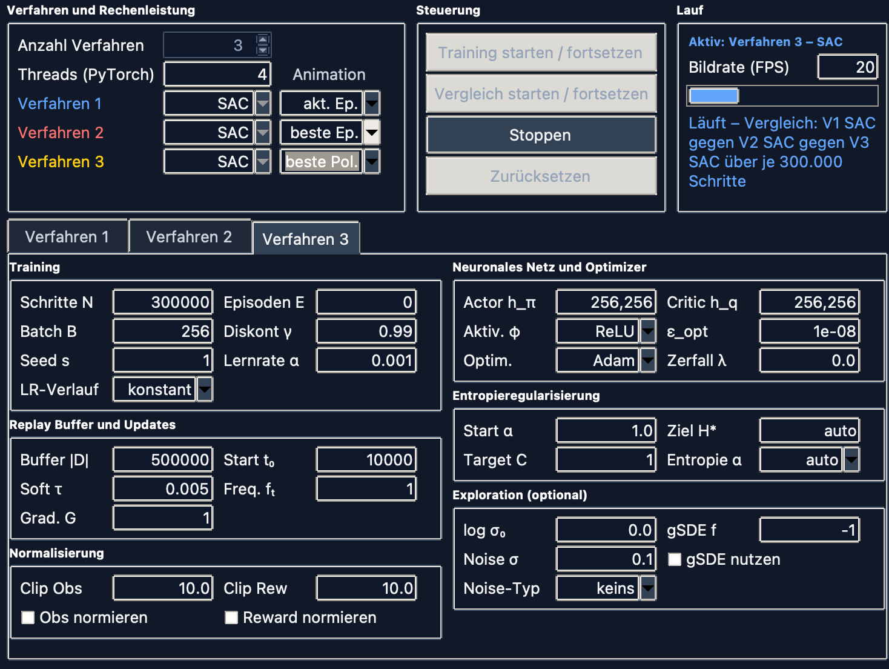

*Oben die Verfahrenswahl mit Animationsmodus je Slot, Steuerung und Statuszeile.
Unten der Reiter des aktiven Verfahrens – hier SAC mit Training, Replay Buffer,
Normalisierung, Netz und Optimizer, Entropieregularisierung und Exploration.*

</div>

Darunter liegt für jedes Verfahren ein eigener Reiter mit **allen** Parametern
dieses Algorithmus: Schritte, Episoden, Lernrate, Batch-Größe, Diskontfaktor,
Zufallsstart, Netzgröße, Optimizer und die verfahrenseigenen Größen. Ein
Parameter, den ein Verfahren nicht besitzt, wird nicht angezeigt – bei PPO gibt
es zum Beispiel keinen Replay Buffer.

Für Teil 2.3 wird derselbe Algorithmus mehrfach ausgewählt und nur ein Parameter
verändert. Die Oberfläche erkennt das und zeigt den abweichenden Parameter
automatisch in der Legende und in der Summary an.

### 1.2 Methoden-Training

**Animation.** Während des Trainings ist die Animation von Anfang an sichtbar.
Jedes Verfahren hat ein eigenes Auswahlfeld und lässt sich einzeln auf `inaktiv`
stellen; die übrigen Anzeigen werden dann größer. So kann man die Animation
während des Trainings jederzeit ein- und ausschalten, ohne den Lauf zu
unterbrechen. Neben dem laufenden Stand (`akt. Ep.`) lässt sich die bisher
beste Episode exakt nachspielen (`beste Ep.`, am `*` hinter der Episodennummer
erkennbar) oder deren Lernstand deterministisch laufen (`beste Pol.`).

<div align="center">

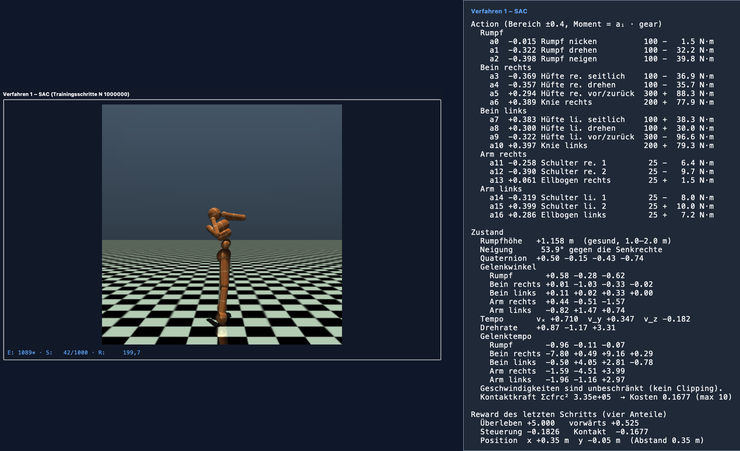

*Links eine der drei Anzeigen: Die Überschrift nennt Slot, Algorithmus und –
weil sich dieser Slot von den anderen unterscheidet – den abweichenden
Parameter; darunter stehen Episode, Schritt und Return, wobei der `*` anzeigt,
dass die beste Episode nachgespielt wird und nicht der laufende Stand. Rechts
die Einblendung, die erscheint, sobald der Mauszeiger über dem Bild steht: die
17 Actions mit ihrem Moment in N·m, Rumpfhöhe und Neigung, Gelenkwinkel,
Geschwindigkeiten, die vier Reward-Anteile und die Position. Von den 348
Beobachtungswerten zeigt sie diese Auswahl; die 286 aus `cinert`, `cvel` und
`cfrc_ext` erklären kein Verhalten und erscheinen nur verdichtet als
Quadratsumme der Kontaktkräfte.*

</div>

**Episodenzahl.** Jedes Verfahren hat ein Feld `Episoden E`, voreingestellt auf
**1000**. Zusätzlich gibt es ein Schrittbudget `Trainingsschritte N`. Der Lauf
endet, was zuerst eintritt, und die Summary zeigt an, welche Grenze gegriffen
hat.

> **Warum zwei Grenzen?** Eine Humanoid-Episode endet, wenn die Figur umfällt.
> Untrainiert fällt sie nach etwa **25 Schritten**, später hält sie mehrere
> hundert Schritte durch. 1000 Episoden sind deshalb mal 25.000 und mal
> 1.000.000 Schritte – je nachdem, wie gut das Verfahren ist. Für einen **fairen**
> Vergleich ist das ungeeignet: Das bessere Verfahren bekäme automatisch mehr
> Trainingsdaten. Die Messläufe dieser Arbeit laufen deshalb mit
> `Episoden E = 0` (unbegrenzt) und einem für alle gleichen Schrittbudget.

**Paralleler Ablauf.** Alle ausgewählten Verfahren trainieren gleichzeitig, jedes
mit eigenem Modell und eigener Environment.

**Reward-Plot.** Im selben Diagramm erscheint für jeden Durchlauf eine eigene
Farbe: V1 blau, V2 rot, V3 gelb, V4 grün. Je Verfahren werden zwei Linien
gezeichnet:

- der **episodenweise Reward** dünn und blass,
- der **Episodendurchschnitt** kräftig (gleitender Durchschnitt, Fenster
  einstellbar, hier 20 Episoden).

Die weiße gestrichelte Linie ist die Zielmarke (siehe 2.1). Die Legende nennt
Slot und Algorithmus, bei mehrfach gewähltem Algorithmus zusätzlich den
abweichenden Parameter.

**Speichern als Bild.** Am Ende jedes Trainings lassen sich das sichtbare
Diagramm als PNG und die Summary als Textdatei speichern. Eine weitere
Schaltfläche schreibt in einer Aktion **je Verfahren** einen eigenen Plot – so
sind die Einzelplots in 2.2 entstanden.

---

## Teil 2: Methodenvergleich und Parametervergleich

### 2.1 Individuelle Zuweisung

Laut Zuordnungstabelle der Aufgabenstellung:

| Nr. | Name | Ort | Animation | Methoden |
| --- | --- | --- | --- | --- |
| 1 | Hessling, Oliver | Berlin | `Humanoid-v5` | PPO, TD3, SAC |

**Das Environment.** `Humanoid-v5` ist eine dreidimensionale menschenähnliche
Figur mit 42 kg Gewicht. Sie hat **17 Gelenke** und liefert **348**
Beobachtungswerte – deutlich mehr als alle vorherigen Übungsumgebungen. Der
Reward setzt sich aus vier Teilen zusammen:

```
Reward = 5,0            + 1,25 · v_x     − 0,1 · Σaᵢ²   − 5e−7 · Σ Kontaktkräfte²
         (Überleben)      (vorwärts)       (Steuerung)     (Aufprall)
```

Der **Überlebensbonus von 5,0 je Schritt ist mit Abstand der größte Anteil**.
Eine Figur, die 1000 Schritte lang nur steht, sammelt allein dadurch 5000.

Die Episode endet, sobald die Rumpfhöhe den Bereich 1,0 bis 2,0 m verlässt – also
beim Umfallen – oder nach 1000 Schritten.

**Zielmarke 5000.** `Humanoid-v5` hat keine offizielle „Gelöst"-Schwelle. Für
diese Arbeit wird eine eigene Marke bei **5000** verwendet, weil sie sich direkt
lesen lässt: Sie entspricht genau 1000 Schritten aufrecht. Sie wird ausdrücklich
nicht „gelöst" genannt.

### 2.2 Reward-Plots, Methodenvergleich

#### 2.2.1 Implementierung

`Humanoid-v5` ist in der selbst erstellten Workbench implementiert. Die drei
zugeteilten Methoden PPO, TD3 und SAC waren bereits vorhanden; die Workbench
musste **nicht** um fehlende Methoden erweitert werden.

#### 2.2.2 Empfohlene Hyperparameter und Reward-Plots

Verwendet werden die empfohlenen Hyperparameter aus dem **RL Baselines3 Zoo**
(Profile für `Humanoid-v4`, geprüft am 24.08.2026):

| Parameter | PPO | TD3 | SAC |
| --- | --- | --- | --- |
| Lernrate | 3,57e−5 | 1e−3 | 3e−4 |
| Diskontfaktor γ | 0,95 | 0,99 | 0,99 |
| Batch-Größe | 256 | 256 | 256 |
| Netz | 256,256 | 256,256 ¹ | 256,256 |
| Normalisierung | **ja** | nein | nein |
| Lernstart | – | 10.000 | 10.000 |
| Action Noise | – | normal, σ 0,1 | – (Entropie) |

Drei Abweichungen von den Profilen, alle offen benannt:

1. ¹ Das TD3-Profil nennt als Netz `400,300`. Vereinheitlicht auf `256,256`,
   damit der Vergleich nicht schon an der Netzgröße hängt – bei drei
   Verfahren, von denen zwei dasselbe Netz verwenden, wäre sonst unklar, ob
   ein Unterschied vom Verfahren oder von der Netzgröße kommt.
2. Der Replay Buffer fasst 500.000 statt 1.000.000 Übergänge und speichert
   Beobachtungen als `float32` statt `float64`. Das ist verhaltensneutral: Bei
   höchstens 500.000 Schritten wird nie ein Übergang verdrängt, und PyTorch
   rechnet ohnehin in `float32`. Mit dem Profilwert bräuchten allein die
   Beobachtungen 5,2 GB je Slot – die Maschine hat 8 GB.
3. Das Schrittbudget liegt unter dem Profilwert; siehe *Versuchsaufbau* und
   die kritische Reflexion.

Sonst ist nichts verändert: kein Reward Shaping, keine geänderten
Abbruchregeln, keine veränderten Beobachtungsschalter.

**Versuchsaufbau:** Alle drei Verfahren laufen mit **300.000
Environment-Schritten** und `Episoden E = 0`. Nur so sehen alle dieselbe
Datenmenge. TD3 und SAC treffen die Zahl genau; PPO endet bei 300.032 Schritten,
weil es in Rollouts von 512 Schritten arbeitet und die Grenze nicht mitten in
einem Rollout ziehen kann – 0,01 % Unterschied.

Der gesamte Vergleich wurde **zweimal** gefahren, einmal mit Zufallsstart
`seed = 0` und einmal mit `seed = 1`; alle übrigen Werte sind in beiden
Durchgängen identisch. Der Grund steht in der Aufgabenstellung selbst: Bewertet
wird die „Stabilität des Lernfortschritts (Variabilität)". Aus **einer** Kurve
je Verfahren lässt sich aber nicht sagen, ob ein Unterschied echt ist oder
Zufall. Mit zwei Durchgängen lässt sich die Streuung *innerhalb* eines
Verfahrens gegen den Abstand *zwischen* den Verfahren halten – und genau das
hat sich hier ausgezahlt (siehe 2.2.4).

##### Gemeinsamer Vergleich

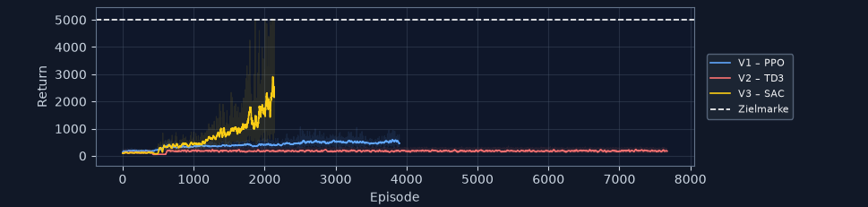

*Durchgang 1 (`seed = 0`).*

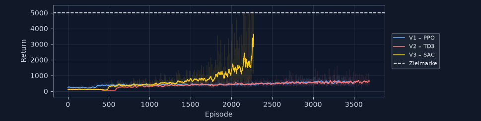

*Durchgang 2 (`seed = 1`).*

Beide Bilder zeigen dasselbe Grundmuster: Die gelbe SAC-Kurve löst sich ab etwa
Episode 1500 nach oben ab, PPO (blau) und TD3 (rot) bleiben unten. Der
Unterschied zwischen den Bildern liegt bei TD3 – dazu 2.2.4.

##### PPO

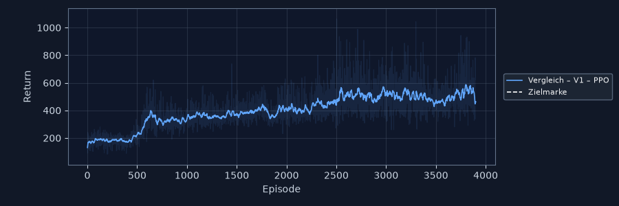

*Durchgang 1 (`seed = 0`).*

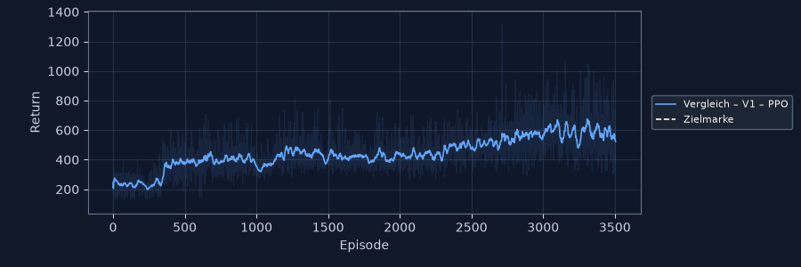

*Durchgang 2 (`seed = 1`).*

PPO steigt in Durchgang 1 von etwa 150 auf 400 innerhalb der ersten 600
Episoden und danach langsam, aber stetig weiter auf rund 550. Durchgang 2 sieht
praktisch gleich aus: Sprung auf etwa 400 bei Episode 400, dann gleichmäßig
weiter auf rund 570. Beide Kurven sind ruhig und haben keinen Einbruch. **PPO
ist das einzige Verfahren, dessen beide Durchgänge man kaum unterscheiden
kann.**

##### TD3


*Durchgang 1 (`seed = 0`).*


*Durchgang 2 (`seed = 1`).*

Hier stehen zwei völlig verschiedene Bilder nebeneinander – bei **identischen
Einstellungen**, nur mit anderem Zufallsstart:

- **Durchgang 1: Stillstand.** Nach dem Lernstart bleibt die Kurve über 7.673
  Episoden flach bei etwa 180. Kein Anstieg, keine Richtung.
- **Durchgang 2: Lernen.** Nach dem Lernstart um Episode 550 springt die Kurve
  auf etwa 250 und steigt danach durchgehend auf rund 600 bei Episode 3.694 –
  die beste Einzelepisode erreicht 1.594,9 statt 361,3.

Der Knick um Episode 500 ist in beiden Bildern der Lernstart: Bis dahin handelt
der Agent zufällig.

##### SAC

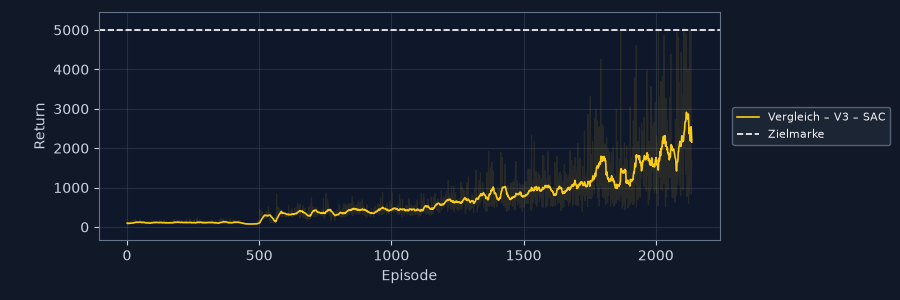

*Durchgang 1 (`seed = 0`).*

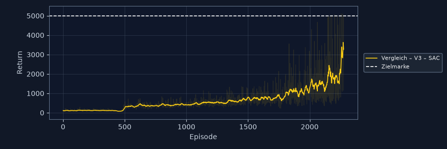

*Durchgang 2 (`seed = 1`).*

SAC liegt in beiden Durchgängen bis Episode 500 bei etwa 120 (Lernstart), steigt
danach stetig an und wird ab Episode 1500 (Durchgang 1) beziehungsweise 1800
(Durchgang 2) deutlich schneller. Am Ende stehen rund 2.900 und rund 3.600. Die
beste Einzelepisode überschreitet in **beiden** Durchgängen die Zielmarke:
5.055,7 und 5.101,9. In Durchgang 2 hält die Figur in 40 % der letzten Episoden
die vollen 1000 Schritte durch.

#### 2.2.3 Vergleich und Bewertung

Alle Kennzahlen sind Mittelwerte über die letzten 20 Episoden eines Laufs
(Glättungsfenster der Workbench); „beste Episode" ist der höchste Einzelwert des
Laufs.

| Kennzahl | PPO D1 | PPO D2 | TD3 D1 | TD3 D2 | **SAC D1** | **SAC D2** |
| --- | --- | --- | --- | --- | --- | --- |
| Episoden in 300.000 Schritten | 3.901 | 3.506 | 7.673 | 3.694 | 2.136 | 2.275 |
| **Ø Return (letzte 20)** | 461,4 | 522,4 | 171,6 | 643,0 | **2.153,9** | **3.269,2** |
| **Beste Einzelepisode** | 1.062,4 | 1.313,3 | 361,3 | 1.594,9 | **5.055,7** | **5.101,9** |
| Ø Episodenlänge (Schritte) | 89 | 96 | 39 | 134 | **434** | **651** |
| Sturzquote | 100 % | 100 % | 100 % | 100 % | 85 % | **60 %** |
| Durchhaltequote (1000 Schritte) | 0 % | 0 % | 0 % | 0 % | 15 % | **40 %** |
| Zielquote (Return ≥ 5000) | 0 % | 0 % | 0 % | 0 % | 5 % | **30 %** |
| Ø Tempo vorwärts (m/s) | 0,43 | 0,61 | 0,06 | 0,16 | 0,21 | 0,23 |
| Ø Strecke vorwärts (m) | 0,7 | 1,0 | −0,0 | 0,4 | 1,5 | 2,3 |
| Ø seitliche Abweichung (m) | 0,52 | 0,43 | 0,16 | 0,63 | 1,18 | 0,91 |

Zusammengefasst über beide Durchgänge:

| | PPO | TD3 | **SAC** |
| --- | --- | --- | --- |
| Ø Return, Mittel beider Durchgänge | 491,9 | 407,3 | **2.711,6** |
| Abstand zwischen den Durchgängen | **61** | **471** | 1.115 |
| Streuung, bezogen auf den eigenen Mittelwert | **12 %** | 116 % | 41 % |

*Zum Vergleich: Eine zufällig handelnde Figur fällt nach etwa 25 Schritten um und
erreicht rund 120 Return.*

**Lernkurve und Konvergenzgeschwindigkeit.** SAC lernt in beiden Durchgängen mit
Abstand am schnellsten. Es braucht nur 2.136 beziehungsweise 2.275 Episoden, um
über 2.000 zu kommen, während PPO in 3.901 Episoden bei 461 bleibt. Im
gemeinsamen Diagramm ist das an der Steigung ablesbar: Die gelbe Kurve wird ab
Episode 1500 steiler, die blaue bleibt flach. Keines der drei Verfahren ist am
Ende auskonvergiert – SAC steigt zuletzt am stärksten und hätte mit mehr
Schritten weiter zugelegt.

**Stabilität und Variabilität.** Hier lohnt der zweite Durchgang, denn
„Stabilität" hat zwei Bedeutungen, und die Verfahren schneiden je nach Bedeutung
anders ab:

| | *innerhalb* eines Laufs (glatte Kurve) | *zwischen* den Läufen (reproduzierbar) |
| --- | --- | --- |
| PPO | sehr ruhig | **sehr gut**: 461 gegen 522 |
| TD3 | ruhig | **sehr schlecht**: 172 gegen 643 |
| SAC | schwankt stark | mittel: 2.154 gegen 3.269, Richtung identisch |

- **PPO ist in beiden Bedeutungen stabil.** Die kräftige Linie verläuft fast
  glatt, die Rohwerte streuen zwischen etwa 200 und 1000, und der zweite
  Durchgang liegt nur 12 % daneben.
- **TD3 ist innerhalb eines Laufs ruhig, zwischen den Läufen aber das
  unzuverlässigste Verfahren.** Der Abstand zwischen seinen beiden Durchgängen
  ist größer als sein eigener Mittelwert.
- **SAC schwankt innerhalb eines Laufs am stärksten.** Die Rohwerte reichen am
  Ende von unter 1000 bis über 5000. Das ist die Kehrseite des schnellen
  Lernens: Der Agent probiert mehr aus, und einzelne Episoden misslingen
  deutlich. Zwischen den Läufen ist die *Richtung* aber identisch – beide
  Durchgänge steigen, beide überschreiten die Zielmarke.

**Maximal erreichter Reward.** SAC erreicht in beiden Durchgängen als einziges
Verfahren die Zielmarke (5.055,7 und 5.101,9) – die Figur bleibt in diesen
Episoden die vollen 1000 Schritte aufrecht. PPO kommt auf 1.062,4 und 1.313,3,
TD3 auf 361,3 und 1.594,9.

#### 2.2.4 Dokumentation der Analyse

**Rangfolge: SAC deutlich vor PPO und TD3; PPO und TD3 sind nicht trennbar.**

Der Abstand von SAC zum Rest ist so groß, dass er nicht am Zufall liegen kann:
SAC erreicht im Mittel beider Durchgänge das **Fünfeinhalbfache** von PPO. Der
schlechtere SAC-Lauf (2.153,9) liegt immer noch mehr als viermal so hoch wie der
bessere PPO-Lauf (522,4). Diese Reihenfolge kann kein Zufallsstart drehen.

Zwischen PPO (491,9) und TD3 (407,3) beträgt der Abstand dagegen nur 85 Punkte –
**weniger als ein Fünftel dessen, was TD3 allein zwischen seinen beiden
Durchgängen schwankt** (471). Für Platz 2 gibt es damit kein belastbares
Ergebnis, und der Bericht behauptet auch keines.

**Was der zweite Durchgang geändert hat.** Nach Durchgang 1 lag die Erklärung
nahe, TD3 lerne mit den empfohlenen Parametern schlicht nicht: eine über 7.000
Episoden exakt flache Kurve sieht nach einem Agenten aus, der in einer
schlechten Strategie feststeckt. Durchgang 2 widerlegt das – **mit denselben
Parametern** steigt TD3 durchgehend auf rund 600 und schafft eine beste Episode
von 1.594,9. Die richtige Aussage ist deshalb nicht „TD3 lernt nicht", sondern:

> **TD3 lernt mit diesen Parametern manchmal und manchmal nicht.** Ob ein Lauf
> gelingt, entscheidet sich früh und hängt am Zufallsstart.

Das ist der stärkste einzelne Beleg dieser Arbeit dafür, dass ein einzelner Lauf
je Verfahren nicht ausreicht – aus Durchgang 1 allein wäre eine falsche Aussage
in den Bericht gewandert.

**Warum SAC vorne liegt.** SAC ist ein Off-Policy-Verfahren mit Replay Buffer:
Jeder gespeicherte Übergang wird mehrfach zum Lernen benutzt. PPO verwirft seine
Daten nach jedem Update. Bei nur 300.000 Schritten zählt jeder Schritt doppelt.
Dazu kommt die gelernte Entropie: SAC regelt selbst, wie viel es ausprobiert,
und zieht die Erkundung zurück, sobald sich eine Strategie auszahlt.

**Warum TD3 so unzuverlässig ist.** TD3 hat denselben Vorteil des Replay
Buffers, nutzt ihn aber nur in einem der beiden Läufe. Auffällig ist die
Lernrate: **1e−3, mehr als dreimal so hoch wie bei SAC**. Bei 348 Eingabewerten
und 17 Ausgängen ist eine große Lernrate genau das, was ein solches Bild
erzeugt: Wenn die ersten Updates in eine brauchbare Richtung zeigen, läuft der
Lauf (Durchgang 2); zeigen sie es nicht, brennt sich die schlechte Strategie
fest und die Kurve bleibt flach (Durchgang 1). Ein zu großer Schritt macht das
Ergebnis vom Startpunkt abhängig.

Ein zweiter Grund kommt hinzu: TD3 hat einen deterministischen Actor und
erkundet nur über festes Rauschen (σ 0,1). SAC passt seine Erkundung selbst an.
Bei einem so hochdimensionalen Problem ist festes Rauschen offenbar zu wenig, um
einen schlechten Start wieder zu verlassen.

**Ein Vorbehalt zu PPO.** Die Zoo-Profile sind für unterschiedlich lange Läufe
gedacht: PPO für 10 Millionen Schritte, TD3 und SAC für je 2 Millionen. Unsere
300.000 Schritte sind bei PPO also nur **3 %** seines vorgesehenen Budgets, bei
TD3 und SAC **15 %**. PPO tritt damit deutlich weiter von seinem Arbeitspunkt
entfernt an. Dieser Vorbehalt bleibt nicht als Vermutung stehen – 2.2.5 misst
ihn nach.

**Eine Beobachtung, die nicht ins Bild passt.** PPO läuft mit 0,43 und 0,61 m/s
am schnellsten vorwärts, SAC nur mit 0,21 und 0,23 m/s – obwohl SAC den
vielfachen Return hat. Der Grund liegt in der Reward-Formel: Der Überlebensbonus
(5,0 je Schritt) ist viel größer als der Vorwärtsanteil (1,25 · v). **Aufrecht
bleiben lohnt sich mehr als schnell laufen.** SAC hat genau das gelernt: lange
stehen bleiben (Ø 434 und 651 Schritte) statt schnell zu rennen und dabei zu
stürzen. PPO fällt nach 89 Schritten um, hat sich in dieser kurzen Zeit aber
schneller bewegt. Weil SAC länger oben bleibt, kommt es am Ende trotzdem weiter:
2,3 m gegen 1,0 m in Durchgang 2.

Auch die seitliche Abweichung passt dazu: SAC driftet mit 1,18 m und 0,91 m in
beiden Durchgängen am weitesten zur Seite. Der Reward bewertet nur die
Vorwärtsrichtung, seitliches Abdriften kostet nichts – solange die Figur nicht
umfällt.

#### 2.2.5 Gegenprobe: PPO mit gleichem Anteil seines Budgets

Der Vorbehalt aus 2.2.4 lässt sich messen statt vermuten. Bekommt PPO denselben
**Anteil** seines Profilbudgets wie die anderen – 15 % von 10 Millionen sind
**1,5 Millionen Schritte** –, holt es dann auf?

Zwei Läufe, `seed = 0` und `seed = 1`, sonst dasselbe Profil wie in 2.2.2,
`Episoden E = 0`, je 1.500.160 Schritte. Rechenzeit: rund 50 Minuten je Lauf –
PPO schafft 481 Schritte in der Sekunde, die Off-Policy-Verfahren nur 50.


*Beide Durchgänge, gemeinsam. Die Zielmarke liegt außerhalb des Bildes, weil
die Y-Achse den Messwerten folgt.*

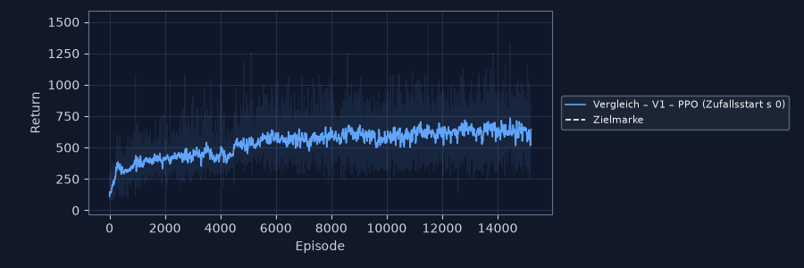

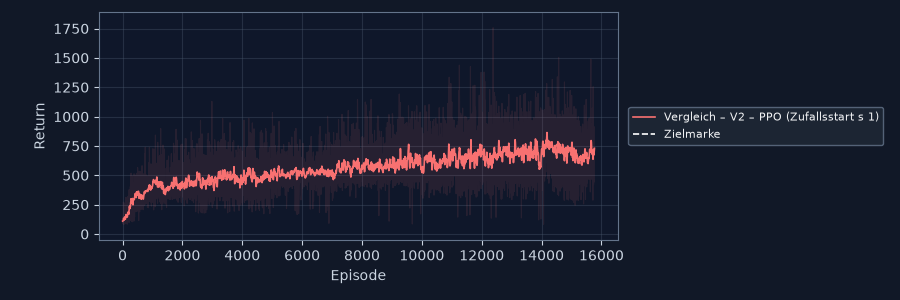

| Kennzahl | 300.000 D1 | 300.000 D2 | **1,5 Mio D1** | **1,5 Mio D2** |
| --- | --- | --- | --- | --- |
| Episoden | 3.901 | 3.506 | 15.206 | 15.766 |
| Ø Return (letzte 20) | 461,4 | 522,4 | **643,4** | **729,8** |
| Beste Einzelepisode | 1.062,4 | 1.313,3 | 1.477,5 | 1.756,9 |
| Ø Episodenlänge | 89 | 96 | 110 | 112 |
| Ø Tempo (m/s) | 0,43 | 0,61 | **1,06** | **1,60** |
| Ø Strecke x (m) | 0,7 | 1,0 | 1,9 | 2,8 |
| Durchhaltequote | 0 % | 0 % | 0 % | 0 % |

**Die Antwort ist nein – und das Warum ist aufschlussreich.**

Der fünffache Datenumfang bringt PPO von 491,9 auf 686,6 im Mittel, also
**+40 %**. Damit liegt es immer noch beim **Vierfachen unter SAC**, das mit
300.000 Schritten auf 2.711,6 kam. Die Rangfolge aus 2.2.3 ist also kein
Artefakt des Schrittbudgets: Auch am gleichen Anteil seines Arbeitspunktes
gemessen bleibt PPO deutlich zurück.

Interessanter ist, **wohin** PPO seine zusätzlichen Daten steckt. Die
Episodenlänge wächst kaum (89 → 110 Schritte), die Durchhaltequote bleibt bei
**0 %** – die Figur fällt nach wie vor in jeder einzelnen Episode um. Was sich
zweieinhalbfacht, ist das **Tempo**: von 0,52 m/s im Mittel auf 1,33 m/s, und
Durchgang 2 erreicht mit 1,60 m/s die höchste Geschwindigkeit aller Läufe
dieser Arbeit – **gut siebenmal so schnell wie SAC** mit seinen 0,22 m/s.

PPO lernt also durchaus, und zwar zielstrebig: Es optimiert den Anteil der
Reward-Formel, der sich schnell auszahlt (`1,25 · vₓ`), und nicht den, der
mehr einbringt (`5,0` je überlebtem Schritt). Bei 1,60 m/s sind das 2,0 Punkte
pro Schritt aus der Vorwärtsbewegung gegen 5,0 aus dem Überleben. Wer 112
Schritte lang schnell rennt, sammelt weniger als wer 651 Schritte lang steht –
so lange hielt SAC in Durchgang 2 im Mittel durch.

Wie das aussieht, zeigt eine Aufzeichnung aus Durchgang 2 nach rund einer
Million Schritten – Episode 11.317, mit 1.501,9 die zu diesem Zeitpunkt beste
des Laufs:

<div align="center">

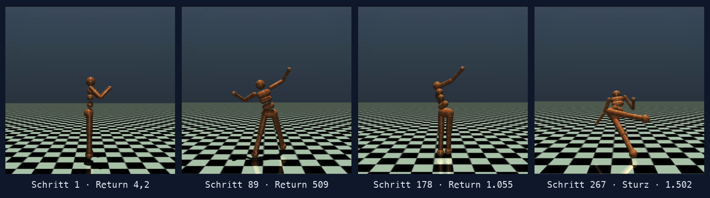

*PPO, Durchgang 2, Episode 11.317 (Return 1.501,9): Die Figur startet aufrecht,
kippt nach vorn und fängt sich mit immer größeren Ausfallschritten, bis sie nach
267 Schritten stürzt. Sie kommt dabei zügig voran — nur eben nicht lange. Das
Video dazu liegt als `animation-7-ppo-…mp4` im Ordner `videos/`; es dauert in
Echtzeit **vier Sekunden**, während die SAC-Episode derselben Trainingsphase
volle 15 Sekunden läuft.*

</div>

Damit erklärt sich auch der Verlauf der Kurve: Zwischen Episode 6.000 und
15.000 steigt sie nur noch von rund 600 auf 700. PPO ist nicht am Ende seines
Lernens, aber es verbessert eine Strategie weiter, die an der falschen Stelle
optimiert.

**Was diese Gegenprobe nicht zeigt:** ob PPO mit dem **vollen** Profilbudget von
10 Millionen Schritten – rund 6 Stunden – irgendwann die Strategie wechselt.
Gleicher Anteil ist nicht dieselbe Datenmenge. Der Vorbehalt schrumpft damit von
„die Rangfolge könnte am Budget liegen" auf „PPO bräuchte eine Größenordnung
mehr Daten, um überhaupt in Reichweite zu kommen".

### 2.3 Reward-Plots, Parameterstudie

#### 2.3.1 Wahl der Methode

Das Kriterium wurde **vor** den Läufen festgelegt, damit die Wahl nicht
nachträglich zum Ergebnis passend begründet wird: mittlerer Return am Ende des
Laufs, gemittelt über **beide** Durchgänge. Der Mittelwert statt des Maximums,
weil ein einzelner Ausreißer sonst die Wahl bestimmt; über beide Durchgänge,
weil ein Glückslauf sonst dasselbe täte.

| | PPO | TD3 | **SAC** |
| --- | --- | --- | --- |
| Ø Return, Mittel beider Durchgänge | 491,9 | 407,3 | **2.711,6** |

**Gewählte Methode: SAC.** Der Abstand ist mit dem Faktor 5,5 so groß, dass die
Wahl unabhängig davon feststeht, wie genau man mittelt.

> *Kleine Abweichung, offen benannt:* Vorab festgelegt waren die letzten **50**
> Episoden, für diese Wahl ausgewertet wurden die letzten **20** – das ist das
> Glättungsfenster, mit dem die Workbench in 2.2 die Zusammenfassung geschrieben
> hat, und die Läufe waren beim Auswerten bereits beendet. Bei einem Abstand von
> Faktor 5,5 ändert das die Wahl nicht. Die Parameterstudie selbst läuft dann
> mit dem festgelegten Fenster von 50.

#### 2.3.2 Wahl des Parameters

**Gewählter Parameter: die Lernrate.** Drei Gründe:

1. Sie existiert in allen drei Verfahren und wirkt unmittelbar auf
   Konvergenzgeschwindigkeit *und* Stabilität – also auf zwei der drei
   Bewertungskriterien der Aufgabenstellung.
2. Sie erlaubt einen sauberen Dreischritt um den empfohlenen Wert: Faktor 3 nach
   unten, Faktor 3 nach oben. Groß genug für einen sichtbaren Unterschied, klein
   genug, dass nicht nur der mittlere Lauf überhaupt etwas lernt.
3. Sie prüft direkt die Erklärung aus 2.2.4. Dort lautet die Vermutung, TD3s
   Unzuverlässigkeit komme von seiner hohen Lernrate `1e−3`. Der große Schritt
   dieser Studie **ist** `1e−3` – SAC bekommt also genau die Lernrate, die bei
   TD3 im Verdacht steht.

Der naheliegende Alternativkandidat wäre der Entropiefaktor α gewesen, die
Besonderheit von SAC. Er scheidet aus einem sachlichen Grund aus: Im empfohlenen
Profil steht α auf `auto`, das heißt, SAC regelt ihn während des Trainings
selbst gegen die Zielentropie −17. Ein eingegebener Wert ist dort nur der
*Startwert* und wird binnen weniger tausend Schritte wegtrainiert – drei
Ausprägungen ergäben drei fast gleiche Kurven. Und stellt man α auf `fest`,
verändert man nicht mehr einen Parameter, sondern schaltet einen Mechanismus ab;
einen „empfohlenen Wert" als Mittelstufe gäbe es dann nicht mehr.

> *Zur Schreibweise:* Die Oberfläche schreibt nach der Konvention der Workbench
> sowohl die Lernrate als auch den Entropiefaktor mit dem Buchstaben α – beides
> sind etablierte Symbole. Gemeint ist immer das Wort davor: `Lernrate α` ist
> die Lernrate, `Entropie α` der Entropiefaktor. In den Legenden von 2.3 steht
> deshalb `Lernrate α`.

| | kleiner | empfohlen (Profil) | größer |
| --- | --- | --- | --- |
| Lernrate SAC | `1e−4` | `3e−4` | `1e−3` |

Alle übrigen Parameter bleiben auf dem SAC-Profil aus 2.2.2, `Episoden E = 0`,
und die drei Slots eines Durchgangs teilen denselben Zufallsstart – die drei
Läufe unterscheiden sich also **ausschließlich** in der Lernrate.

Gefahren wurden – wie in 2.2 – **zwei Durchgänge**, `seed = 0` und `seed = 1`.
Nach der TD3-Erfahrung aus 2.2.4 wäre ein einzelner Durchgang je Ausprägung
nicht aussagekräftig; wie berechtigt das war, zeigt 2.3.4.

**Zum Budget.** Geplant waren 500.000 Schritte, damit die Kurven Zeit haben
auseinanderzulaufen. Durchgang 1 wurde nach gut fünf Stunden von Hand bei rund
**300.400 Schritten** je Slot beendet – drei SAC-Slots gleichzeitig rechnen
langsamer als der gemischte Durchgang aus 2.2, und die Abgabe hat einen Termin.
Durchgang 2 lief von vornherein mit `N = 300.000`. Drei Folgen:

- Die drei Ausprägungen bleiben **untereinander fair**. In Durchgang 1 liegen
  sie 283 Schritte oder 0,1 % auseinander (300.410 / 300.451 / 300.168), in
  Durchgang 2 endeten zwei genau am Schrittbudget, während der Profilwert bei
  306.190 Schritten von Hand beendet wurde – 2 % mehr. Wo dieser Vorsprung
  etwas ändern könnte, steht es in der Bewertung dabei.
- Beide Durchgänge stehen bei rund 300.000 Schritten und sind damit
  untereinander vergleichbar.
- Der Vergleich mit 2.2 wird dadurch sogar **besser**: Beide Teile der Arbeit
  stehen jetzt bei derselben Schrittzahl.

#### 2.3.3 Ergebnisse

Alle Kennzahlen sind Mittelwerte über die **letzten 50 Episoden** – das
Glättungsfenster stand in beiden Durchgängen auf 50 und entspricht damit genau
dem in 2.3.1 vorab festgelegten Kriterium.

##### Gemeinsamer Vergleich


*Durchgang 1 (`seed = 0`). Blau `1e−4`, rot `3e−4` (Profilwert), gelb `1e−3`.*

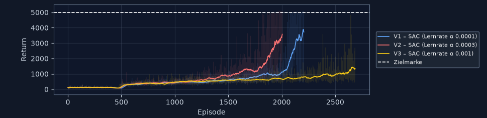

*Durchgang 2 (`seed = 1`), dieselben Farben.*

Beide Bilder zeigen dieselbe Dreiteilung: Zwei Kurven lösen sich ab Episode
1500 nach oben, die gelbe bleibt unten. **Welche** der beiden oben zuerst
abhebt, ist allerdings in jedem Durchgang eine andere.

##### Kleine Lernrate `1e−4`

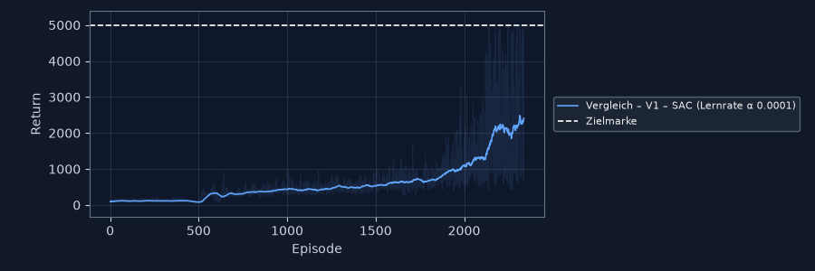

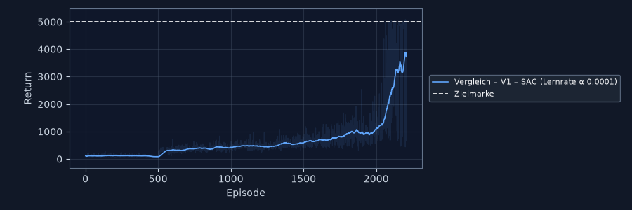

Beide Durchgänge bleiben lange flach und heben spät ab – in Durchgang 1 ab
Episode 1800 auf rund 2.400, in Durchgang 2 ab Episode 1900 auf rund 3.800.
Der zweite Durchgang endet dabei am steilsten Punkt seiner Kurve.

##### Empfohlene Lernrate `3e−4`

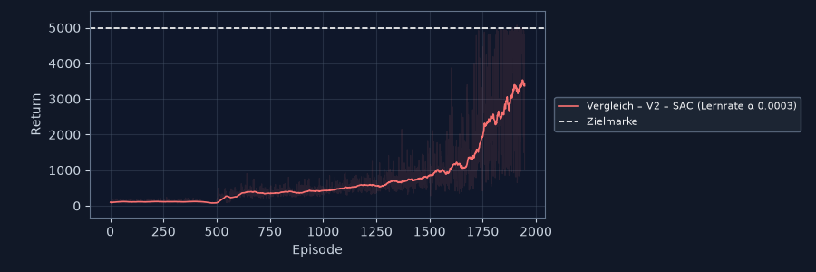

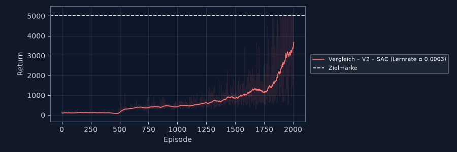

Löst sich in beiden Durchgängen als **erste** nach oben, ab Episode 1500, und
erreicht rund 3.500. Die beiden Kurven ähneln einander so stark, dass man sie
ohne Beschriftung verwechseln könnte – dazu 2.3.4.

##### Große Lernrate `1e−3`

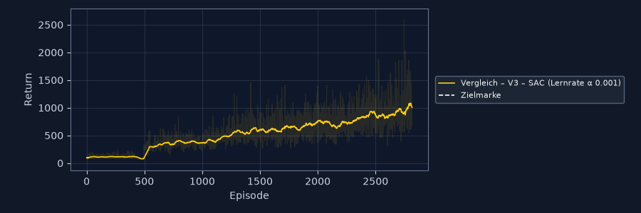

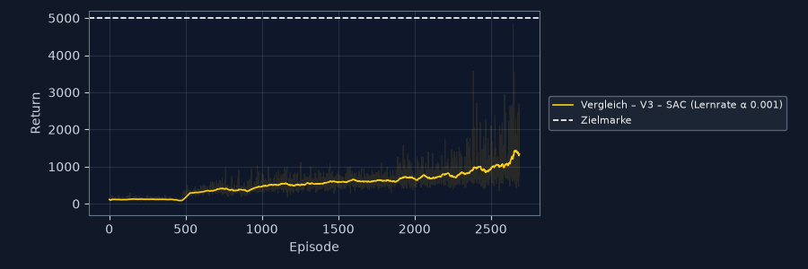

Steigt gleichmäßig, aber flach, und endet bei rund 1.000 beziehungsweise 1.400.
Kein Absturz, kein Ausbruch nach oben: Die Figur lernt etwas, aber nichts, was
sie länger als 200 bis 280 Schritte aufrecht hält.

##### Zahlen

| Kennzahl | `1e−4` D1 | `1e−4` D2 | **`3e−4` D1** | **`3e−4` D2** | `1e−3` D1 | `1e−3` D2 |
| --- | --- | --- | --- | --- | --- | --- |
| Episoden | 2.338 | 2.207 | 1.947 | 2.005 | 2.816 | 2.687 |
| **Ø Return (letzte 50)** | 2.406,5 | **3.721,4** | 3.370,7 | 3.578,3 | 1.008,1 | 1.335,4 |
| **Beste Einzelepisode** | 4.999,6 | 5.086,5 | 5.071,0 | **5.094,1** | 2.591,2 | 4.816,5 |
| Ø Episodenlänge | 490 | **755** | 685 | 714 | 200 | 277 |
| Durchhaltequote | 12 % | **68 %** | 46 % | 44 % | 0 % | 0 % |
| Zielquote (≥ 5000) | 0 % | 12 % | 6 % | **34 %** | 0 % | 0 % |
| Ø Tempo (m/s) | 0,17 | 0,12 | 0,18 | **0,22** | 0,30 | 0,06 |
| Ø Strecke x (m) | 1,3 | 1,9 | 1,6 | **2,5** | 1,1 | 0,4 |
| Ø seitlich (m) | 0,63 | 0,32 | 0,59 | 0,97 | 0,37 | 0,46 |

Zusammengefasst über beide Durchgänge:

| | `1e−4` klein | **`3e−4` Profil** | `1e−3` groß |
| --- | --- | --- | --- |
| Ø Return, Mittel beider Durchgänge | 3.064,0 | **3.474,5** | 1.171,8 |
| gegenüber dem Profilwert | −12 % | – | **−66 %** |
| Abstand zwischen den Durchgängen | 1.314,9 | **207,6** | 327,3 |
| Streuung, bezogen auf den eigenen Mittelwert | 43 % | **6 %** | 28 % |

#### 2.3.4 Bewertung

**Einfluss des Parameters.** Die Lernrate ist der erwartet sensitive Parameter,
und ihr Einfluss ist **nicht symmetrisch**: Derselbe Faktor 3 kostet nach oben
66 % des Returns, nach unten 12 %. Das passt zum Mechanismus. Eine zu kleine
Lernrate macht dieselben Schritte, nur kleinere – der Lauf ist **später dran**,
nicht auf einem schlechteren Weg; beide `1e−4`-Kurven heben rund 400 Episoden
nach dem Profilwert ab. Eine zu große Lernrate überschreitet in jedem Update
das Ziel; Actor und Critic jagen einander, und der Agent bleibt in einer
mittelmäßigen Strategie hängen, die er nicht mehr verlässt.

Am deutlichsten zeigt das die **Episodenlänge**: 685 und 714 Schritte beim
Profilwert, 200 und 277 bei der großen Lernrate. Der Return folgt fast genau
diesem Verhältnis – wieder der Überlebensbonus, der die Skala bestimmt.

**Beste Einstellung: der empfohlene Wert `3e−4`** – aber die Begründung ist eine
andere, als der bloße Mittelwert nahelegt:

- Gegen `1e−3` ist der Abstand **eindeutig**. Faktor 3,0 im Mittel, in beiden
  Durchgängen dieselbe Richtung, und die große Lernrate erreicht die Zielmarke
  in **keiner einzigen** Episode.
- Gegen `1e−4` ist der Abstand im Mittel klein (3.474,5 gegen 3.064,0, +13 %) –
  und **kleiner als die Streuung von `1e−4` selbst** (1.314,9). In Durchgang 1
  gewinnt der Profilwert deutlich, in Durchgang 2 verliert er knapp. Aus dem
  Return allein ist hier **nichts** zu entscheiden.

Was den Ausschlag gibt, sind zwei Kennzahlen, die in beiden Durchgängen
dieselbe Richtung zeigen:

1. **Die Zielquote.** Der Profilwert überschreitet die Marke von 5000 in beiden
   Durchgängen (6 % und 34 %), die kleine Lernrate nur in einem (0 % und 12 %).
2. **Die Streuung.** Die beiden `3e−4`-Läufe liegen 208 Punkte auseinander, die
   beiden `1e−4`-Läufe 1.315. Der Profilwert ist damit **sechsmal
   reproduzierbarer** – bei einem Verfahren, das man einmal ansetzt und nicht
   zehnmal wiederholen kann, ist das der praktisch wichtigere Vorzug.

Die Empfehlung des Zoo bestätigt sich also, aber nicht als „höchster Return" –
sondern als **verlässlichster** Return.

**Unerwartete Effekte.** Vier Beobachtungen, die so nicht zu erwarten waren:

1. **Die Reihenfolge zwischen `1e−4` und `3e−4` dreht sich mit dem
   Zufallsstart.** Genau das hatte die Vorab-Festlegung als Risiko benannt, und
   genau das ist eingetreten. Ein einzelner Durchgang hätte hier zu der Aussage
   geführt „die kleine Lernrate ist schlechter" (Durchgang 1) oder „die kleine
   Lernrate ist besser" (Durchgang 2) – beide falsch.
2. **Stehen und Gehen sind zwei verschiedene Lernziele.** In Durchgang 2 hält
   `1e−4` länger durch als der Profilwert (68 % gegen 44 %), erreicht die
   Zielmarke aber seltener (12 % gegen 34 %) und kommt nur 1,9 m statt 2,5 m
   vorwärts. Der Grund steckt in der Rechnung: 1000 Schritte aufrecht ergeben
   *genau* 5000; wer die Marke überschreiten will, muss sich zusätzlich
   **vorwärts bewegen**. Die kleine Lernrate hat sicheres Stehen gelernt, der
   Profilwert vorsichtiges Gehen.
3. **Die große Lernrate war in Durchgang 1 die schnellste Figur von allen** –
   0,30 m/s gegen 0,18 m/s beim Profilwert – und trotzdem die schlechteste. Sie
   wirft sich nach vorn und fällt nach 200 Schritten um. Dasselbe Muster wie
   bei PPO in 2.2.4: Wer die Reward-Formel nicht kennt, hielte diesen Lauf beim
   Zusehen für den besten.
4. **Die These aus 2.2.4 über TD3 bestätigt sich.** Dort lautete die Vermutung,
   TD3 versage in einem von zwei Durchgängen, weil sein Profil `1e−3` vorgibt
   und das bei 348 Eingabewerten zu groß ist. Genau dieser Wert ist die große
   Ausprägung dieser Studie – und er kostet **innerhalb desselben Verfahrens,
   bei identischem Zufallsstart und identischem Budget, zwei Drittel des
   Returns**. Sauberer lässt sich die Erklärung mit den vorhandenen Läufen
   nicht stützen: Alles andere ist konstant gehalten, nur die Lernrate nicht.

**Ein Nebenbefund zur Reproduzierbarkeit.** Die mittlere Ausprägung ist
dieselbe Konfiguration wie der SAC-Lauf aus 2.2, mit demselben Zufallsstart und
praktisch demselben Budget. Sie liefert **ähnliche, aber nicht identische**
Ergebnisse:

| | 2.2 (SAC, Seed 0) | 2.3 (`3e−4`, Seed 0) |
| --- | --- | --- |
| Schritte | 300.000 | 300.451 |
| Episoden | 2.136 | 1.947 |
| Beste Episode | #2107: 5.055,7 | #1911: 5.071,0 |

Gleicher Seed heißt hier also **nicht** gleicher Lauf. Der Grund liegt im
Aufbau: Ein Vergleich führt seine Slots als Threads **eines** Prozesses aus, und
alle greifen auf denselben Zufallsstrom von PyTorch zu. Welcher Slot welche
Zahl bekommt, hängt davon ab, wie das Betriebssystem die Threads verschachtelt –
und das ist von Lauf zu Lauf verschieden. Dazu kommt, dass PyTorch mit mehreren
Threads Summen nicht immer in derselben Reihenfolge bildet; winzige
Rundungsunterschiede genügen, damit zwei Läufe nach 300.000 Schritten
auseinanderlaufen.

Für diese Arbeit ist das kein Fehler, sondern eine Eigenschaft, die man kennen
muss: **Der Seed macht Läufe vergleichbar, nicht identisch.** Genau deshalb
stehen die Aussagen dieses Berichts auf mehreren Durchgängen und nicht auf
Nachkommastellen einzelner Zahlen.

#### 2.3.5 Was diese Studie nicht zeigt

Zwei Durchgänge je Ausprägung sind mehr, als Vorgabe 2.3d verlangt – sie
verlangt **ein** Training je Ausprägung –, und trotzdem zu wenig, um die beiden
oberen Werte zu trennen. Dafür bräuchte es fünf bis zehn Durchgänge je
Ausprägung, rund 25 Stunden Rechenzeit. Der Bericht behauptet deshalb an keiner
Stelle, `1e−4` sei schlechter; belegt ist, dass es **unzuverlässiger** ist.

Zwei kleinere Einschränkungen, offen benannt: Der Profilwert lief in Durchgang 2
mit 306.190 statt 300.000 Schritten – 2 % mehr, was seinen dortigen Rückstand
auf `1e−4` eher noch etwas vergrößert als verkleinert. Und keine der sechs
Kurven war am Ende auskonvergiert; alle stiegen zum Schluss noch. Die Studie
vergleicht damit **Lerngeschwindigkeit bei knappem Budget**, nicht den
Endzustand.

### 2.4 Ausblick: Was mit 7 Millionen Schritten passiert

Der Vergleich in 2.2 und 2.3 steht bei 300.000 Schritten, und an mehreren
Stellen sagt dieser Bericht denselben Satz: Was dort zu sehen ist, ist die
**Frühphase** des Lernens. Diese Behauptung lässt sich prüfen. Nach Abschluss
der bewerteten Läufe wurde **ein** SAC-Lauf mit dem unveränderten Profil bis auf
**7 Millionen Schritte** fortgesetzt — rund 21 Stunden Rechenzeit, in mehreren
Abschnitten über die Funktion „Training fortsetzen".

<div align="center">

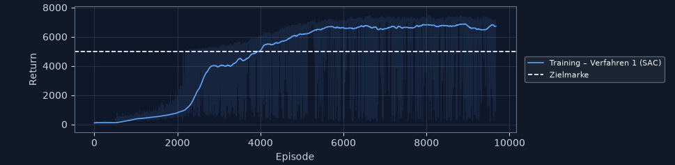

*9.670 Episoden. Flach bis Episode 2.000, steiler Anstieg bis 3.000, die
Zielmarke fällt bei rund 4.000, ab 5.500 ein Plateau über 6.500.*

</div>

| Kennzahl | 300.000 Schritte (2.2) | **7 Mio Schritte** |
| --- | --- | --- |
| Ø Return | 2.153,9 / 3.269,2 | **6.717,8** |
| Beste Einzelepisode | 5.055,7 | **7.469,8** |
| Ø Episodenlänge | 434 / 651 | **952** |
| Ø Tempo vorwärts | 0,21 m/s | **1,95 m/s** |
| Ø Strecke vorwärts | 1,5 m | **28,6 m** |
| Durchhaltequote | 15 % / 40 % | **91,8 %** |
| Zielquote | 5 % / 30 % | **93,8 %** |

**Die Figur läuft.** Das ist die eigentliche Antwort: nicht der höhere Return,
sondern **1,95 m/s und 28,6 Meter**. Bei 300.000 Schritten kam sie 1,5 Meter
weit und blieb dabei im Wesentlichen stehen. Jetzt legt sie in neun von zehn
Episoden die vollen 1000 Schritte zurück und bewegt sich dabei zügig vorwärts.

**Der Benchmark ist erreicht.** Der RL Baselines3 Zoo gibt für SAC auf Humanoid
nach 2 Millionen Schritten `6232,3 ± 279,9` an. Dieser Lauf steht bei
**6.717,8** — mit demselben Profil, nur mit mehr Budget. Die Umsetzung in dieser
Workbench erreicht die Referenz also nicht nur ungefähr, sondern übertrifft sie.

**Die Reihenfolge aus der Reward-Formel bestätigt sich.** Der Bericht erklärt in
2.2.4 und 2.3.4, warum Aufrechtbleiben zuerst gelernt wird und Vorwärtskommen
erst danach: Der Überlebensbonus von 5,0 je Schritt ist der größere Anteil, und
wer nach 100 Schritten umfällt, sammelt nichts mehr ein. Genau diese Reihenfolge
zeigt die Kurve. Bis Episode 4.000 wächst vor allem die Episodenlänge — die
Figur lernt stehen. Erst als sie zuverlässig oben bleibt, beginnt der
Vorwärtsanteil zu tragen, und der Return steigt über die Marke von 5000, die
reinem Stehen entspricht. **Ein Return über 5000 ist der Beweis, dass sie sich
bewegt.**

<div align="center">

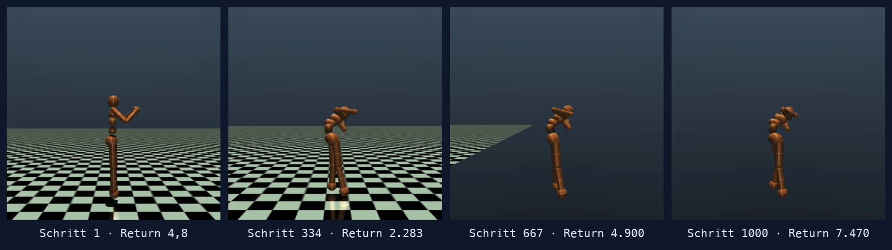

*Episode 8.083, die beste des gesamten Laufs: 1000 Schritte, Return 7.469,8.
Der Boden zeigt, wie weit sie dabei kommt — das ist kein Stehen mehr.*

</div>

Im Abgabeordner liegen sieben Videos, alle in **Echtzeit** und damit
unmittelbar vergleichbar: `animation-1-fruehphase` zeigt die Frühphase, in der
die Figur immer wieder fällt; `animation-5-ep8083` zeigt in derselben
Zeitspanne von 15 Sekunden **eine** Episode, die durchläuft. Sechs Videos
dauern diese 15 Sekunden, weil die Episode über die vollen 1000 Schritte läuft;
nur `animation-7-ppo` ist nach vier Sekunden vorbei — dort stürzt die Figur
nach 267 Schritten, und genau das ist die Aussage des Bildes. Dazwischen
dokumentieren `animation-2`, `animation-3` und `animation-4` denselben Lauf nach rund 1, 2 und 3
Millionen Schritten mit 5.134, 6.372 und 7.186 Punkten; der Fortschritt ist von
Video zu Video zu sehen.

**Was dieser Lauf nicht ist.** Er gehört ausdrücklich **nicht** zum bewerteten
Vergleich und steht deshalb hier statt in 2.2:

- Er hat ein anderes Budget. Ein Vergleich mit PPO und TD3 wäre nur bei
  gleicher Schrittzahl zulässig, und die hätte bei den beiden zusammen weitere
  40 Stunden gekostet.
- Er ruht auf **einem** Zufallsstart. Nach den Erfahrungen aus 2.2.4 und 2.3.4
  heißt das: Die Größenordnung ist belastbar, die Nachkommastellen sind es
  nicht.
- Der Replay Buffer fasst 500.000 Übergänge. Bis 500.000 Schritte war diese
  Verkleinerung verhaltensneutral, ab dort verdrängt er die ältesten Übergänge —
  hier also während des größten Teils des Laufs. Mit dem Profilwert von einer
  Million wäre das Ergebnis möglicherweise noch besser ausgefallen.

Für den Bericht ändert dieser Ausblick nichts an den Ergebnissen von 2.2 und
2.3. Er beantwortet nur die Frage, die dort offenbleiben musste: **Ja, das
Verfahren kommt an — es braucht dafür das Zwanzigfache des Budgets, mit dem
verglichen wurde.**

### 2.5 Ausblick: Neuere Verfahren bei gleichem Budget

Der Vergleich in 2.2 nimmt die drei Verfahren, die die Aufgabe zuteilt. Seit
deren Veröffentlichung sind neuere Nachfolger von SAC erschienen. Ein
Seitenprojekt außerhalb dieses Abgabeordners stellt deshalb die
Anschlussfrage: **Holt ein neueres Verfahren bei genau demselben Budget mehr
heraus?**

Verglichen wurden `SAC` als Referenz, **`CrossQ`** und **`TQC`** — beide aus
`sb3-contrib`, also Referenzimplementierungen, keine Eigenbauten. Alle drei
unterscheiden sich **allein im Critic**:

| | Critic | Target-Netze |
| --- | --- | --- |
| `SAC` | Minimum zweier Critics | ja |
| `CrossQ` | zwei Critics, viermal breiter | **nein** — Batch Normalization ersetzt sie |
| `TQC` | 2 × 25 Quantile, obere werden verworfen | ja |

Budget, Zufallsstart, Replay Buffer, Batch und Lernstart sind identisch;
300.000 Schritte, `seed = 0`, ein Durchgang.

#### Zwei Messungen, zwei Bedeutungen von „fair"

Ein Vergleich braucht eine Bezugsgröße, und es gibt zwei sinnvolle. Deshalb
wurden **zwei** Zwischenstände desselben Laufs festgehalten.

**Erstens bei gleicher Rechenzeit.** Alle drei Slots liefen gleich lange, hatten
zu diesem Zeitpunkt aber verschieden viele Schritte geschafft:

<div align="center">

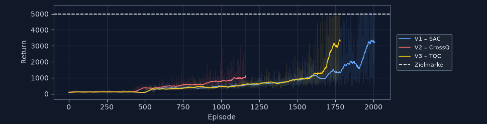

</div>

| bei gleicher Laufzeit | **SAC** | CrossQ | TQC |
| --- | --- | --- | --- |
| Schritte | **292.641** | 103.717 | 226.802 |
| Ø Return (letzte 50) | 3.258,6 | 1.144,8 | **3.299,5** |

**CrossQ schafft in derselben Zeit nur gut ein Drittel der Schritte.** Sein
breiter Critic mit Batch Normalization kostet je Update ein Vielfaches. Wer nach
„Was bekomme ich in einer Stunde?" fragt, sieht CrossQ hier abgeschlagen.

**Zweitens bei gleicher Schrittzahl.** Am Ende hatten alle drei 300.000
Schritte gesehen — dieselbe Datenmenge wie der Verfahrensvergleich in 2.2:

<div align="center">

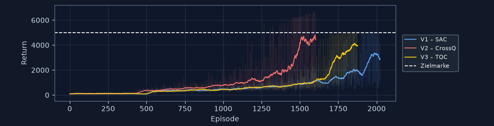

</div>

| bei 300.000 Schritten | SAC | **CrossQ** | TQC |
| --- | --- | --- | --- |
| Ø Return (letzte 50) | 2.893,0 | **4.434,6** | 3.975,9 |
| Beste Einzelepisode | 5.150,1 | **6.680,4** | 5.105,4 |
| Ø Episodenlänge | 578 | 699 | **795** |
| Durchhaltequote | 20 % | **64 %** | 54 % |
| Zielquote | 14 % | **64 %** | 20 % |
| Ø Tempo vorwärts | 0,21 m/s | **1,06 m/s** | 0,23 m/s |
| Ø Strecke vorwärts | 2,1 m | **14,0 m** | 2,6 m |

**Die Rangfolge dreht sich vollständig um.** Nach Rechenzeit ist CrossQ das
Schlusslicht, nach Datenmenge das mit Abstand beste Verfahren — mit einem
Vorsprung von 53 % vor SAC. Beides ist richtig; die Antwort hängt davon ab,
welche Ressource knapp ist. Wer Simulationsschritte teuer bezahlt — bei einem
echten Roboter etwa —, wählt CrossQ. Wer Rechenzeit knapp hat, wählt SAC.

Genau dafür ist CrossQ entworfen: Es tauscht Rechenaufwand je Schritt gegen
Sample-Effizienz.

#### Und es läuft

<div align="center">

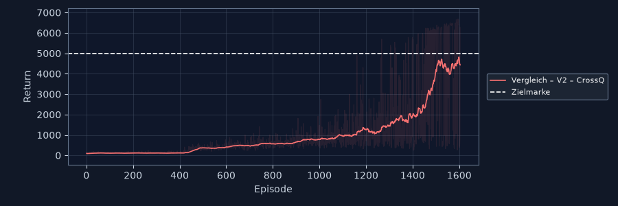

*CrossQ, 300.000 Schritte, ein Durchgang. Beste Episode 6.680,4.*

</div>

Der auffälligste Wert steht in der Tempozeile: **1,06 m/s und 14,0 Meter je
Episode**. Das ist fünfmal so weit wie alles, was der Verfahrensvergleich bei
derselben Schrittzahl gezeigt hat. Der Ausblick in 2.4 brauchte für vergleichbar
laufende Figuren **7 Millionen** Schritte — CrossQ kommt mit 300.000 in diese
Nähe. Die Zielquote von 64 % sagt dasselbe: In zwei von drei Episoden
überschreitet es die Marke, die reinem Stehen entspricht, bewegt sich also
wirklich vorwärts.

#### Nicht nur schneller, sondern besser

Der Vergleich oben endet bei 300.000 Schritten, weil dort das Budget des
Verfahrensvergleichs liegt. Weitergelaufen zeigt CrossQ, dass der Vorsprung
nicht nur ein Vorsprung in der Zeit ist:

<div align="center">

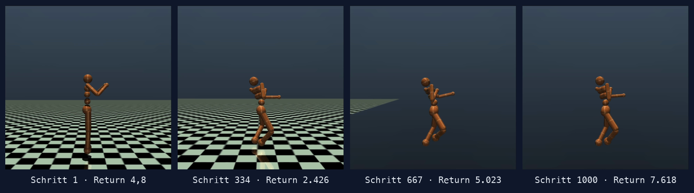

*CrossQ, Episode 1.931 nach rund 600.000 Schritten: 1000 Schritte,
**Return 7.617,5** – zum Aufnahmezeitpunkt die beste Episode des Laufs, kurz
darauf übertroffen von #1964 mit 7.669,9. Das Video dazu liegt als
`animation-6-crossq-…mp4` im Ordner `videos/`.*

</div>

Zwei Dinge daran sind bemerkenswert. **Erstens der Wert:** 7.617,5 übertrifft
die beste Episode des langen SAC-Laufs aus 2.4 (7.469,8) — und zwar nach
**600.000 statt 7 Millionen** Schritten, also mit gut einem Zehntel der Daten.

**Zweitens die Haltung.** SAC läuft auch nach 7 Millionen Schritten in
gekrümmter Haltung, mit vorgebeugtem Rumpf und tief angewinkelten Beinen — eine
Gangart, die den Überlebensbonus sichert und dabei irgendwie vorankommt. CrossQ
joggt **aufrecht**, mit gestrecktem Rumpf und deutlichem Schrittwechsel. Beide
Verfahren optimieren dieselbe Formel und finden trotzdem verschiedene Lösungen;
die von CrossQ sieht nicht nur besser aus, sie ist auch die höher bewertete.

Weitergelaufen bis 600.000 Schritte — der doppelten Datenmenge des
Verfahrensvergleichs — sieht der Stand so aus:

<div align="center">

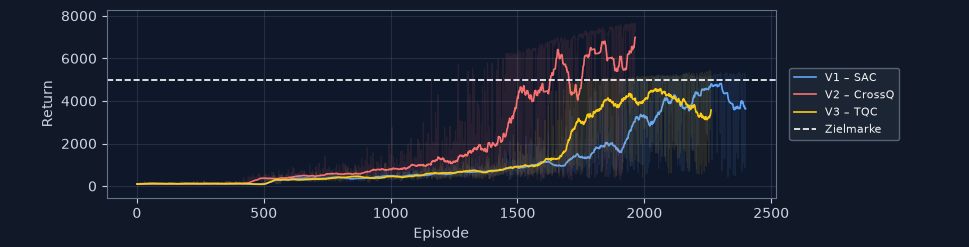

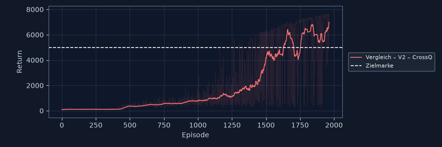

*Oben alle drei gemeinsam, unten `CrossQ` allein. Ab Episode 1.400 steigt seine
Kurve steil an und überschreitet die Zielmarke, während `SAC` und `TQC` sie erst
gegen Episode 2.200 streifen. `CrossQ` kommt dabei mit weniger Episoden aus –
seine Episoden sind länger, dieselbe Schrittzahl verteilt sich also auf weniger
davon. Die dünne Linie zeigt, dass auch am Ende noch einzelne Episoden früh
abbrechen.*

</div>

| bei 600.000 Schritten | SAC | **CrossQ** | TQC |
| --- | --- | --- | --- |
| Ø Return (letzte 50) | 3.633,7 | **6.988,3** | 3.573,3 |
| Beste Einzelepisode | 5.337,0 | **7.669,9** | 5.457,1 |
| Ø Episodenlänge | 701 | **937** | 678 |
| Durchhaltequote | 44 % | **80 %** | 40 % |
| Zielquote | 46 % | **86 %** | 42 % |
| Ø Tempo vorwärts | 0,37 m/s | **2,29 m/s** | 0,45 m/s |
| Ø Strecke vorwärts | 4,2 m | **32,3 m** | 4,9 m |

Der Vergleich mit 2.4 ist der eigentliche Befund: **CrossQ erreicht mit 600.000
Schritten einen höheren Durchschnitt (6.988) als SAC mit 7 Millionen (6.718)** —
bei einem Zwölftel der Daten, und mit 2,29 gegen 1,95 m/s auch schneller. SAC
und TQC liegen bei demselben Budget gleichauf und weit dahinter.

#### Was dieser Vergleich nicht ist

- **Ein Durchgang, ein Zufallsstart.** Nach den Erfahrungen aus 2.2.4 und 2.3.4
  heißt das: Der Abstand CrossQ zu SAC ist mit 53 % groß genug, um die Richtung
  zu glauben; die Reihenfolge von CrossQ und TQC ist es nicht.
- **CrossQ läuft nicht auf seinem Profilwert.** Der Zoo sieht für Humanoid einen
  Critic mit `2048` vor, verwendet wurde die Voreinstellung von `sb3-contrib`
  mit `1024`; der Lernstart steht bei allen dreien einheitlich auf 10.000
  statt der 5.000 des CrossQ-Profils. Beides eher zu CrossQs Nachteil.
- **Auch der 600.000-Schritte-Lauf ist ein Einzelfall.** Eine Episode, ein
  Zufallsstart — die Haltung ist im Video zu sehen, die Verallgemeinerung
  bräuchte mehrere Durchgänge.
- **Kein Teil der bewerteten Arbeit.** Die Aufgabe teilt PPO, TD3 und SAC zu.
  Dieser Abschnitt zeigt, was mit denselben Werkzeugen darüber hinaus möglich
  ist — die Workbench musste dafür nur um zwei Einträge erweitert werden.

---

## Teil 3: Dokumentation und Präsentation

### 3.1 Dokumentation

Dieses Dokument. Alle Abbildungen sind im Abgabeordner abgelegt und oben
eingebunden; zur Übersicht liegen sie nach Art des Materials in vier
Unterordnern:

| Ordner / Datei | Inhalt |
| --- | --- |
| `KLR-339-2026-08-Hessling_Oliver.md`, `.pdf` | dieser Bericht, Quelle und Satz |
| `praesentation.md`, `praesentation.html`, `praesentation-notizen.md` | Folien, Vortragsfassung und Sprechtext |
| `README.md`, `prompt.md` | technische Dokumentation und Vorgabenabgleich |
| **`diagramme/`** | **25 Reward-Plots**: Verfahrensvergleich (8), Gegenprobe zum Budget (3), Parameterstudie (8), langer Lauf (1), neuere Verfahren (5) |
| **`kennzahlen/`** | **9 Summary-Dateien**, je Lauf die Kennzahlen **und die vollständige Konfiguration** |
| **`screenshots/`** | **4 Bilder der Anwendung**: Gesamtfenster, Konfigurator, Messwerte-Einblendung, Bedienungsanleitung |
| **`videos/`** | **7 Videos** in Echtzeit, dazu 5 Standbildstreifen für die PDF-Fassung |
| `humanoid_*.py`, `tests/` | Quellcode (4.686 Zeilen) und Testsuite (2.833 Zeilen, 210 Tests) |

Sechs der sieben Videos zeigen den Lernverlauf in derselben Zeitspanne von
15 Sekunden: `animation-1-fruehphase` mit mehreren Episoden, in denen die Figur
immer wieder fällt, bis `animation-6-crossq` mit einer vollen Episode über
7.600. Das siebte, `animation-7-ppo`, ist kürzer, weil die Episode dort nach
267 Schritten endet. Die Dateinamen tragen Episodennummer und Return, sind also
ohne Nachschlagen einzuordnen.

Jede Summary-Datei führt neben den Kennzahlen **alle** Parameter des Laufs auf.
Damit ist jede Zahl dieses Berichts auf ihre Konfiguration zurückzuführen und
nachvollziehbar wiederholbar.

Die Anwendung erklärt sich zusätzlich selbst: Oben rechts öffnet
`Bedienungsanleitung` ein eigenes Fenster mit Ablauf, Budgetregeln,
Environment, Verfahren, Diagrammen, Summary, Animation und Laufzeiten.

<div align="center">

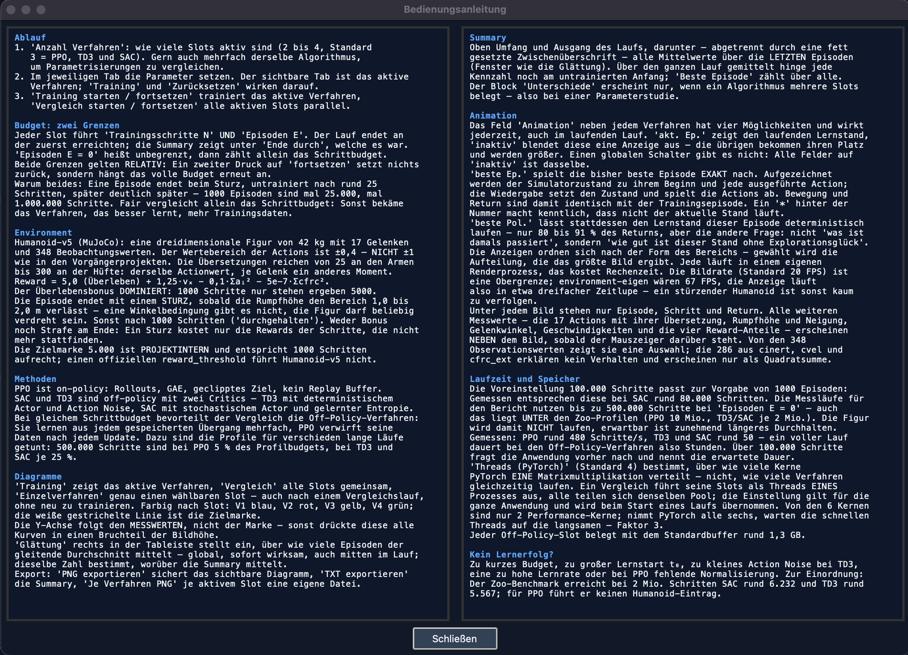

*Zweispaltig, damit der Text ohne Scrollen auf den Bildschirm passt.*

</div>

### 3.2 Präsentation

20 Folien für 10 bis 12 Minuten, als `praesentation.md` im selben Verzeichnis,
dazu `praesentation.html` als Vortragsfassung, in der die Videos direkt in der
Folie laufen; der Sprechtext je Folie steht getrennt in
`praesentation-notizen.md`.

Der Aufbau folgt bewusst nicht der Gliederung dieses Berichts, sondern einer
Frage: **Warum gewinnt das langsamste Verfahren?** Die Reward-Formel steht
deshalb ganz vorn, und jedes spätere Ergebnis wird auf sie zurückgeführt – der
TD3-Zufallsbefund, PPOs Tempo-Paradox und der Unterschied zwischen Stehen und
Gehen in der Parameterstudie. Alle sieben Videos sind eingebunden: die
Frühphase, in der die Figur in derselben Viertelminute immer wieder fällt; vier
Stationen desselben langen Laufs nach 1, 2, 3 und 7 Millionen Schritten; PPO
und SAC nebeneinander bei gleichem Trainingsstand; und zum Schluss der
aufrecht joggende CrossQ-Lauf.

---

## Kritische Reflexion

**Was diese Arbeit zeigt – und was nicht.**

1. **Zwei Durchläufe sind besser als einer – und immer noch wenig.** Im
   Verfahrensvergleich wurde jede Konfiguration zweimal gefahren, mit
   Zufallsstart 0 und 1. Das hat sich sofort ausgezahlt: TD3 sah im ersten
   Durchgang aus wie ein Verfahren, das überhaupt nicht lernt, und im zweiten
   wie eines, das ordentlich lernt (siehe 2.2.4). Zwei Läufe reichen aber nur,
   um **grobe** Unterschiede abzusichern. Der Abstand SAC zu PPO (Faktor 5,5)
   ist damit belegt; der Abstand PPO zu TD3 (85 Punkte gegen 471 Punkte eigene
   Streuung) ausdrücklich **nicht**. Wer Platz 2 wirklich entscheiden will,
   braucht fünf bis zehn Durchgänge je Verfahren – rund 20 Stunden Rechenzeit
   statt 6. In der Parameterstudie hat sich derselbe Effekt ein zweites Mal
   gezeigt: Zwischen `3e−4` und `1e−4` dreht sich die Reihenfolge mit dem
   Zufallsstart. Zwei Durchgänge genügen also, um eine falsche Aussage zu
   **verhindern**, aber nicht, um jede Frage zu **entscheiden**.

2. **Bei 300.000 Schritten läuft die Figur nicht – geprüft, wo die Grenze
   liegt.** Was in 2.2 und 2.3 zu sehen ist, ist die **Frühphase**: der
   Übergang von „fällt sofort um" zu „bleibt eine Weile stehen". Am Ende von
   Durchgang 2 hält SAC in 40 % der Episoden die vollen 1000 Schritte durch, in
   der Parameterstudie mit der kleinen Lernrate sogar in 68 % — vorwärts kommt
   sie dabei kaum. Der Ausblick in 2.4 zeigt, was fehlte: Mit 7 Millionen
   Schritten, also dem Zwanzigfachen, geht dieselbe Konfiguration mit 1,95 m/s
   und übertrifft den Zoo-Benchmark. Der Vergleich in dieser Arbeit misst
   deshalb **Lerngeschwindigkeit bei knappem Budget**, nicht das Endergebnis
   der Verfahren.

3. **Die Budgets der Verfahren sind ungleich fair – geprüft und entschärft.**
   Gleiche Schrittzahl heißt nicht gleiche Ausgangslage, weil die empfohlenen
   Parameter für verschiedene Laufzeiten gedacht sind. Die Gegenprobe in 2.2.5
   gibt PPO denselben Anteil seines Profilbudgets wie den anderen und zeigt:
   Der Rückstand bleibt. Offen ist nur noch, was das **volle** Profilbudget von
   10 Millionen Schritten täte – rund 6 Stunden Rechenzeit.

4. **TD3 wurde nicht nachgebessert.** Die Aufgabe verlangt die *empfohlenen*
   Parameter. Dass TD3 damit nur in einem von zwei Läufen lernt, ist ein
   Ergebnis und kein Fehler. Eine kleinere Lernrate hätte vermutlich geholfen –
   geprüft wird das in 2.3 allerdings an SAC, nicht an TD3, weil die
   Aufgabenstellung die Parameterstudie am **besten** Verfahren verlangt.

5. **Gleicher Seed heißt nicht gleicher Lauf.** Zwei Läufe mit identischer
   Konfiguration und identischem Zufallsstart – der SAC-Lauf aus 2.2 und die
   mittlere Ausprägung aus 2.3 – liefern 2.136 gegen 1.947 Episoden und
   verschiedene Spitzenepisoden. Ursache ist der geteilte Zufallsstrom mehrerer
   Trainings-Threads in einem Prozess (Einzelheiten in 2.3.4). Wer exakte
   Wiederholbarkeit braucht, müsste die Slots als eigene Prozesse starten und
   PyTorch auf einen Thread festlegen – und dafür ein Vielfaches an Rechenzeit
   bezahlen.

6. **Eine Beobachtung zur Messung selbst.** Die drei Kurven im gemeinsamen
   Diagramm enden bei verschiedenen Episodennummern (in Durchgang 1: SAC bei
   2.136, TD3 bei 7.673), obwohl alle gleich viele *Schritte* hatten. Das ist
   kein Fehler, sondern die Kernaussage in einem Bild: **SAC braucht weniger
   Episoden, weil seine Episoden länger sind.** Bei TD3 ist die Episodenzahl
   sogar der schnellste Blick auf Erfolg oder Misserfolg: 7.673 kurze Episoden
   im misslungenen Lauf, 3.694 längere im gelungenen. In der Parameterstudie
   wiederholt sich das: 2.816 Episoden bei der großen Lernrate gegen 1.947 beim
   Profilwert – dieselbe Schrittzahl, gut dreimal so lange Episoden.

---

## Anhang: Vorgabenabgleich

Jede Vorgabe der Aufgabenstellung mit der Stelle, an der sie erfüllt ist. Die
Nummerierung folgt der Aufgabenstellung; `H` sind die Hinweise zum Bericht,
`A` die Abgabemodalitäten.

### Teil 1 — Erstellung einer RL-Workbench

| # | Vorgabe | erfüllt in |
| --- | --- | --- |
| E1 | Workbench aus **Konfigurator und ausführendem Teil** | Teil 1, beide Bilder |
| 1.1a | Python-Programm mit **Tkinter**-Oberfläche | Teil 1; Quellcode `humanoid_gui.py` |
| 1.1b | zugewiesene Animation und Methoden nutzen | 2.1 — `Humanoid-v5` mit PPO, TD3, SAC |
| 1.1c | beste Methode wählen, sensitiver Parameter in 3 Ausprägungen | 2.3.1 und 2.3.2 |
| 1.2a | Animation im Training **anzeigen** | 1.2, Bild „Animationsanzeige" |
| 1.2b | während des Trainings **an- und abschaltbar** | 1.2 — Feld je Verfahren, `inaktiv` wirkt im laufenden Lauf |
| 1.2c | Eingabe **Anzahl Episoden**, Voreinstellung **1000** | 1.2 „Episodenzahl"; Feld `Episoden E` im Konfiguratorbild |
| 1.2d | Methoden **idealerweise parallel** trainieren | 1.2 „Paralleler Ablauf" — alle Slots gleichzeitig |
| 1.2e | episodenweiser Reward **dünn** gezeichnet | 1.2 „Reward-Plot"; in jedem der 25 Plots sichtbar |
| 1.2f | Episodendurchschnitt **fett** gezeichnet | 1.2 „Reward-Plot"; Fenster einstellbar (20 bzw. 50) |
| 1.2g | **eigene Farbe je Durchlauf, im selben Diagramm** | Vergleichsplots in 2.2.2, 2.2.5 und 2.3.3 |
| 1.2h | Reward-Anzeige **als Image speicherbar** | 1.2 „Speichern als Bild" — alle 25 Plots sind so entstanden |
| 1.2i | **qualifizierte Legende** | 1.2; sichtbar in 2.3.3 (`SAC (Lernrate α 0.0003)`) |

### Teil 2 — Methoden- und Parametervergleich

| # | Vorgabe | erfüllt in |
| --- | --- | --- |
| 2.2a | zugeteilte Animation implementieren | 2.2.1 |
| 2.2b | Workbench um fehlende Methoden erweitern | 2.2.1 — nicht erforderlich, alle drei vorhanden |
| 2.2c | **empfohlene optimale** Hyperparameter verwenden | 2.2.2, mit drei offen benannten Abweichungen |
| 2.2d | **für jede Methode ein** Reward-Plot über die Episoden | 2.2.2 — sechs Einzelplots, X-Achse Episoden |
| 2.2e | Bewertung **Lernkurve und Konvergenzgeschwindigkeit** | 2.2.3 |
| 2.2f | Bewertung **Stabilität und Variabilität** | 2.2.3 — getrennt nach *innerhalb* und *zwischen* den Läufen |
| 2.2g | Bewertung **maximal erreichter Reward** | 2.2.3 — Zeile „Beste Einzelepisode" |
| 2.2h | Analyse und Bewertung dokumentieren | 2.2.4 und 2.2.5 |
| 2.3a | sensitiven Parameter wählen **und begründen** | 2.3.2 — Lernrate, drei Gründe, Alternative verworfen |
| 2.3b | **drei Ausprägungen**: empfohlen, kleiner, größer | 2.3.2 — `1e−4`, `3e−4`, `1e−3` |
| 2.3c | in **unterschiedlichen** Reward-Plots darstellen | 2.3.3 — sechs getrennte Einzelplots |
| 2.3d | je Ausprägung **ein Training** mit Reward-Plot | 2.3.3 — je **zwei** Durchgänge statt einem |
| 2.3e | Bewertung: Einfluss, beste Einstellung, unerwartete Effekte | 2.3.4 — alle drei Punkte einzeln |
| 2.3f | Analyse und Bewertung dokumentieren | 2.3.4 und 2.3.5 |

### Teil 3, Hinweise und Abgabe

| # | Vorgabe | erfüllt in |
| --- | --- | --- |
| 3.1 | kurzer, aussagekräftiger Bericht in **Markdown** | dieses Dokument, mit Kurzfassung am Anfang |
| 3.2 | kurze **Präsentation** | 3.2 — `praesentation.md` und `praesentation.html`, 20 Folien für 10–12 Minuten |
| H1 | Beschreibung der Applikation **mit Screenshot** | Teil 1 — vier Abbildungen der Anwendung |
| H2 | **alle** Reward-Plots übersichtlich einfügen | 25 Plots in 2.2.2, 2.2.5, 2.3.3, 2.4 und 2.5, gesammelt in `diagramme/` |
| H3 | Beobachtungen klar und nachvollziehbar | jede Zahl stammt aus einer Summary-Datei im Ordner, siehe 3.1 |
| H4 | **einfache, verständliche Sprache** | durchgehend; Fachbegriffe bei erster Nennung erklärt |
| H5 | Bewertungen mit **konkreten Beobachtungen** belegen | 2.2.3, 2.2.4, 2.3.4 — jede Aussage mit Kurve oder Kennzahl |
| A1 | Abgabe als **PDF** bis 28.08.2026, 15:00 | PDF-Export dieses Dokuments |
| A2 | Unterordner **`Projekt`** unterhalb des eigenen Namens | `Oliver/Projekt` |
| A3 | Datei **`KLR-339-2026-08-Nachname_Vorname.md`** | `KLR-339-2026-08-Hessling_Oliver.md` |
| A4 | **alle** Bilder, Videos, Grafiken in dieses Verzeichnis | 34 Bilder und 7 Videos im Abgabeordner, nach Art des Materials in `diagramme/`, `kennzahlen/`, `screenshots/` und `videos/` sortiert |

Zwei Vorgaben sind bewusst **übererfüllt**: 2.3d verlangt ein Training je
Ausprägung — gefahren wurden zwei, und ohne den zweiten wäre die Bewertung in
2.3.4 falsch ausgefallen. 2.2c verlangt die empfohlenen Hyperparameter — die
Gegenprobe in 2.2.5 prüft zusätzlich, ob das dabei entstehende Budgetgefälle
die Rangfolge erklärt.
