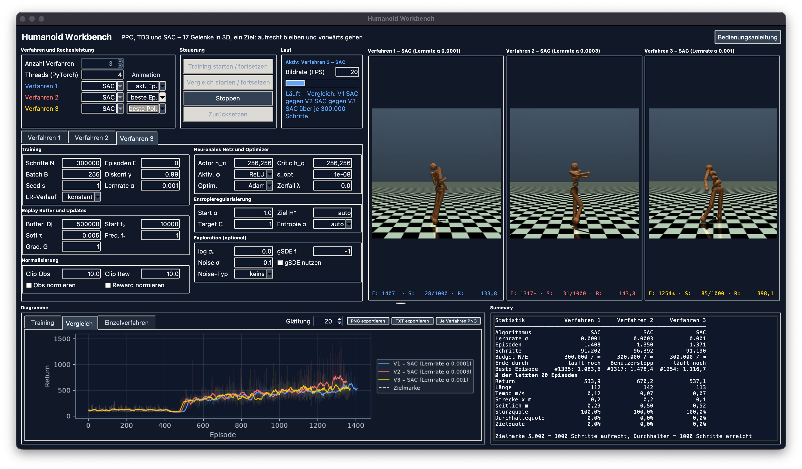
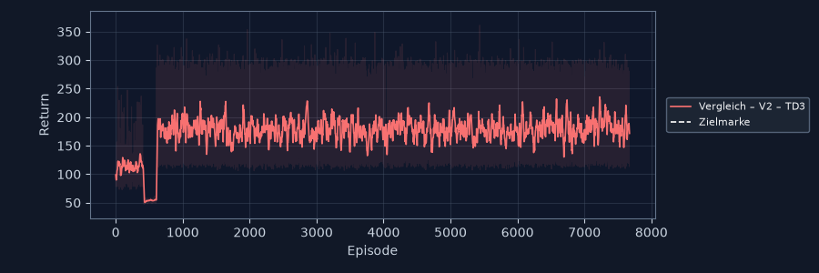
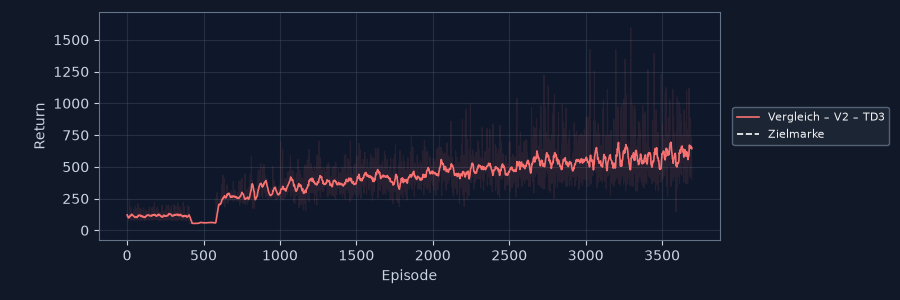
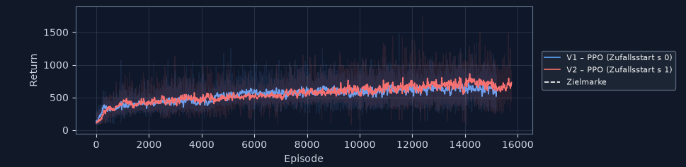
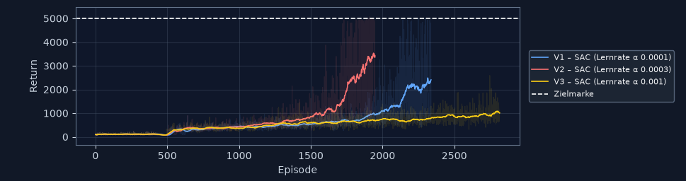
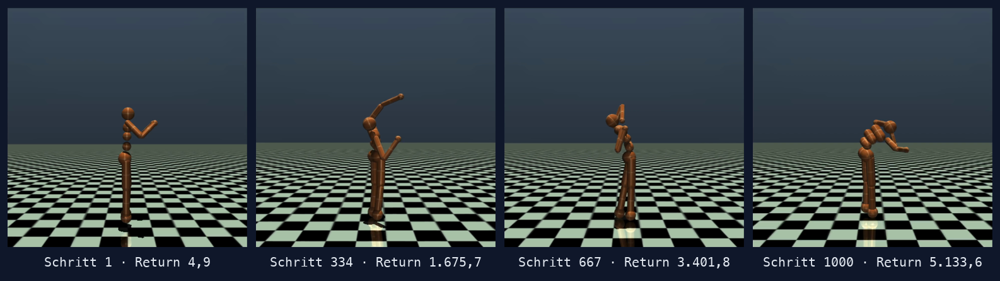

# Eine Figur, die stehen bleiben soll

## `Humanoid-v5` mit PPO, TD3 und SAC

**Oliver Hessling** · Kurs D21195UYS · AlfaTraining, August 2026

<!-- VIDEO 1: animation-sturz.mp4 — untrainierte Figur, fällt nach ~25 Schritten -->

---

# Warum Humanoid anders ist

| | Hopper | HalfCheetah | Walker2d | **Humanoid** |
| --- | --- | --- | --- | --- |
| Beobachtungswerte | 11 | 17 | 17 | **348** |
| Gelenke | 3 | 6 | 6 | **17** |
| Raum | 2D | 2D | 2D | **3D** |

- Actions im Bereich **±0,4** — nicht ±1 wie bei allen Vorgängern
- Übersetzung je Gelenk **25 bis 300**: derselbe Wert, ganz anderes Moment
- 42 kg, die in **drei** Richtungen umfallen können

---

# Die Formel, die alles erklärt

```text
Reward =    5,0      +  1,25 · vₓ   −  0,1 · Σaᵢ²  −  5e−7 · Σcfrc²
         (Überleben)    (vorwärts)     (Steuerung)     (Aufprall)
```

## Der Überlebensbonus dominiert alles andere

**1000 Schritte nur stehen = 5000 Return.**
Bei 1 m/s bringt Vorwärtslaufen 1,25 — Aufrechtbleiben das Vierfache.

> Zielmarke **5000** = 1000 Schritte aufrecht. Projektintern gesetzt,
> `Humanoid-v5` hat keine offizielle Gelöst-Schwelle.

---

# Die Workbench



**Konfigurator** links: 2 bis 4 Verfahren, jeder Parameter einzeln

**Ausführender Teil** rechts: Live-Animation je Verfahren

**Unten**: Reward-Plots und Kennzahlen

Alle Slots trainieren **gleichzeitig**, jeder in eigenem Renderprozess

---

# Was die Anwendung zeigt


Unter dem Bild nur **Episode, Schritt, Return**

Beim Überfahren mit der Maus: 17 Actions mit Moment in N·m, Rumpfhöhe,
Neigung, Gelenkwinkel, alle vier Reward-Anteile

Von 348 Werten zeigt sie eine **begründete Auswahl** — 286 davon
erklären kein Verhalten

`beste Ep.` spielt die beste Episode **exakt** nach, nicht nachgerechnet

---

# Versuchsaufbau

**Empfohlene Hyperparameter** aus dem RL Baselines3 Zoo, unverändert

| | PPO | TD3 | SAC |
| --- | --- | --- | --- |
| Lernrate | 3,57e−5 | 1e−3 | 3e−4 |
| Normalisierung | ja | nein | nein |

- **300.000 Schritte** je Verfahren, Episodengrenze aus
- **Zwei Durchgänge** je Konfiguration, Zufallsstart 0 und 1

> Warum Schritte statt Episoden? Wer besser lernt, hat längere Episoden —
> und bekäme bei gleicher Episodenzahl **mehr** Trainingsdaten.

---

# Der Vergleich: die Bilder


Gelb SAC · blau PPO · rot TD3 — zwei Durchgänge, dasselbe Muster

---

# Der Vergleich: die Zahlen

| Ø der letzten 20 Episoden | PPO | TD3 | **SAC** |
| --- | --- | --- | --- |
| Return, Mittel beider Durchgänge | 491,9 | 407,3 | **2.711,6** |
| Beste Einzelepisode | 1.313 | 1.595 | **5.102** |
| Episodenlänge | 89 / 96 | 39 / 134 | **434 / 651** |
| 1000 Schritte durchgehalten | 0 % | 0 % | **15 / 40 %** |

**SAC gewinnt mit Faktor 5,5.**
Der schlechtere SAC-Lauf schlägt den besseren PPO-Lauf noch um das Vierfache.

---

# Die Überraschung: TD3




**Gleicher Algorithmus. Gleiche Parameter. Nur ein anderer Zufallsstart.**

Links: 7.673 Episoden lang flach bei 172 — sieht aus wie „lernt nicht"

Rechts: steigt durchgehend auf 643, beste Episode 1.595

Aus **einem** Lauf wäre eine falsche Aussage in den Bericht gewandert.

---

# Warum SAC vorn liegt — und PPO hinten

**SAC** ist off-policy: Jeder gespeicherte Übergang wird mehrfach benutzt.
Die Entropie regelt selbst, wie viel der Agent ausprobiert.

**PPO** verwirft seine Daten nach jedem Update. Bei 300.000 Schritten
zählt jeder Schritt doppelt.

**TD3** hat denselben Buffer-Vorteil, aber eine Lernrate von `1e−3` —
dreimal so hoch wie SAC. Bei 348 Eingabewerten hängt der Erfolg
damit am Startpunkt.

---

# Gegenprobe: War der Vergleich fair?

**Der Einwand:** 300.000 Schritte sind bei PPO nur 3 % seines
Profilbudgets — bei TD3 und SAC 15 %.

**Die Messung:** PPO mit 1,5 Mio Schritten, also ebenfalls 15 %.



| | 300.000 | 1,5 Mio |
| --- | --- | --- |
| Ø Return | 491,9 | 686,6 **(+40 %)** |
| Tempo | 0,52 m/s | **1,33 m/s** |
| 1000 Schritte durchgehalten | 0 % | **0 %** |

---

# Wer rennt, verliert

PPO steckt die fünffache Datenmenge **nicht** ins Aufrechtbleiben,
sondern ins Tempo: bis **1,60 m/s** — siebenmal schneller als SAC.

Und fällt trotzdem nach 112 Schritten um.

> Bei 1,60 m/s bringt die Vorwärtsbewegung 2,0 Punkte je Schritt.
> Das Überleben bringt 5,0. **Wer 112 Schritte rennt, sammelt weniger
> als wer 685 Schritte steht.**

Die Rangfolge SAC vor PPO ist also **kein** Artefakt des Budgets.

---

# Parameterstudie: die Lernrate von SAC



`1e−4` (blau) · `3e−4` Profilwert (rot) · `1e−3` (gelb) — je zwei Durchgänge

| Ø der letzten 50 | `1e−4` | **`3e−4`** | `1e−3` |
| --- | --- | --- | --- |
| Return, Mittel | 3.064 | **3.475** | 1.172 |
| Streuung zwischen den Durchgängen | 43 % | **6 %** | 28 % |
| Zielmarke erreicht | 0 / 12 % | **6 / 34 %** | nie |

---

# Was wirklich entschieden hat

**Nicht der Return.** `3e−4` gewinnt Durchgang 1 und verliert Durchgang 2 —
der Abstand ist kleiner als die eigene Streuung.

**Sondern Verlässlichkeit:** Die beiden `3e−4`-Läufe liegen 208 Punkte
auseinander, die beiden `1e−4`-Läufe 1.315. **Sechsmal reproduzierbarer.**

## Und ein Befund, den ich nicht erwartet hatte

`1e−4` hält **länger** durch (68 % gegen 44 %), erreicht die Zielmarke aber
**seltener** (12 % gegen 34 %).

**Die kleine Lernrate lernt sicheres Stehen — der Profilwert vorsichtiges Gehen.**

---

# Der Durchbruch



**1000 Schritte aufrecht, Return 5.133,6** — die Zielmarke gefallen.

<!-- VIDEO 2: animation-beste-episode.mp4 — beste Episode, Echtzeit -->

---

# Was ich mitnehme

**Ein Lauf ist kein Ergebnis.** Zweimal hätte ein einzelner Durchgang zu
einer falschen Aussage geführt — bei TD3 und bei der Lernrate.

**Gleicher Seed heißt nicht gleicher Lauf.** Mehrere Trainings-Threads
teilen sich einen Zufallsstrom; zwei identisch konfigurierte Läufe
lieferten 2.136 gegen 1.947 Episoden.

**Die Reward-Formel erklärt jedes einzelne Ergebnis.** Wer sie kennt,
sagt vorher, warum das schnellste Verfahren das schlechteste ist.

**Was fehlt:** Budget. Der Zoo-Benchmark erreicht mit SAC nach 2 Mio
Schritten 6.232 — wir stehen nach 300.000 bei 2.712.

---

# Danke

**Alles im Abgabeordner:** Bericht, 19 Reward-Plots, Summaries jedes Laufs,
Videos, Quellcode mit 210 Tests

## Fragen?
